## KDE Quick Start

openSUSE® offers all tools which Linux* users require for their daily activities. The product is supplied with a user-friendly graphical environment (KDE Desktop) which communicates with the basic Linux system in order to access files, folders, and programs and manage them. openSUSE offers an integrated suite of applications for a broad range of activities (Office, multimedia, Internet). The LibreOffice suite is also included. This enables you to edit and save files in many formats. As LibreOffice is available for different operating systems, you can use the files you have created with it on several computer platforms.

### 1.  Getting Started

When you start your system, you are usually prompted to enter your user name and password. If you have not installed your system yourself, ask your system administrator for the user name and password.

The KDE Desktop appears after first logging into KDE. Its appearance depends on whether openSUSE® could activate the 3D functions of your graphics card. Optics and functionality in both cases are the same, only the operation differs slightly.

### 2.  The Standard KDE Desktop

When you log into KDE for the first time, the KDE desktop is displayed which contains the following basic elements:

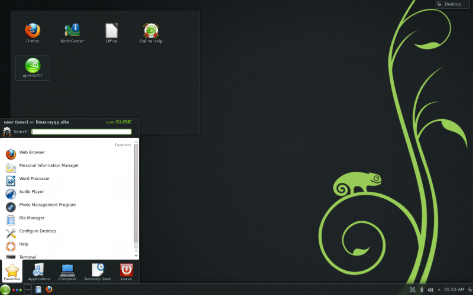

**Desktop folder:**  The content of the ~/Desktop Directory is displayed as standard on the milk glass surface on the top left. Any file placed in this directory also appears in this view.

**Desktop context menu:**  Right-click on an empty area on the desktop in order to access the Context menu which you can use to change the appearance of the desktop, add the desktop control bars or mini programs (widgets), configure desktop settings, fix mini programs in the current position (lock), lock the screen or terminate the current session.

**Toolbox:**  Click on the icon at the very top right of the desktop with the mouse to access the menu which you can use to add or lock mini programs.

**KDE control bar:**  As standard, the control bar on the lower edge of the KDE desktop contains the icon for the *Main Menu* on the left side and further mini programs and program icons and the icon for the control bar settings on the right side. A short description of the icon is displayed when you point the mouse pointer at an icon in the control bar.

**Main menu:**  Click in the lower control bar on the left to open the main menu. The *Main Menu* consists of the following elements: a search function at the top and different tabs below, which offer rapid access to the key menu functions. Your registration name and the host name of the computer are also displayed in the menu.

### 3. Starting programs

Start programs in the *Main Menu*, in the command line with the help of a shell or the *Execute a command* option. Programs can also be launched from the desktop or the control bar by clicking once on the program icon with the left mouse button.

####3.1. Using the main menu

To open the *Main Menu*, click on the *Main Menu* icon in the control bar or press `Alt`–`F2`.

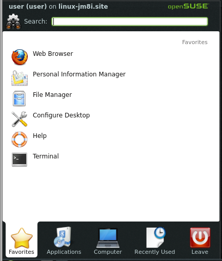
    A standard selection of pre-programmed shortcuts for quick access is displayed under *Favorites* All the applications installed in your system can be seen under *Applications*. Click on the relevant entry to navigate through the menu structure. You can return via the breadcrumb menu (the light gray text directly at the top right above the menu points). You only need to click on a previous menu point there. To jump back to Start, select *All programs*. The *Computer* and *History* tabs provide fast access to frequently used storage locations, applications, and documents. Under *Quit* you can find various options for ending the session, such as logging off, locking the screen (further access is only possible with a password), shutting down and restarting the computer. Some computers offer to put your session on RAM or a data medium into deep sleep mode.

If you use a program often and do not want to access it through the menu structure every time, you can add its icon to the *Favorites* tab. To do so, right-click on any other tab in the program and select *Add to Favorites*.

####3.2. Use the “Execute command” dialog box

KRunner is a helper application which lets you quickly start programs. It also offers a search function to search for applications or storage locations.

Press `Alt`–`F2` to open the Execute command dialog box. Enter a command, for example dolphin. Even during input, a list of applications or actions is displayed in the dialog box which match your entry. Select one of the results, or press `Enter` to start the highlighted application or action. The command to start is often (but not always) the application name written in lower case letters.

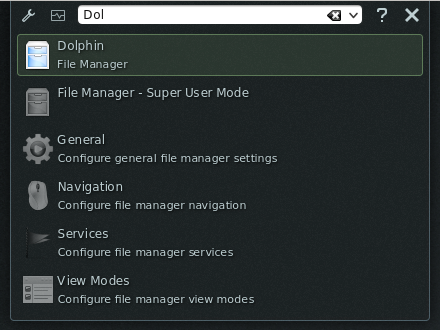

In the *Execute command* dialog box you can use different functions: Click on the question mark icon to display a list of active functions. To edit or retrieve a list of all functions, click on the cogwheel icon. You can use so-called *web key shortcuts* which are defined in Konqueror to send search enquiries directly to a search engine without needing to open the browser beforehand. Another interesting function is the calculation of a mathematical expression such as** =2+2^4-sin(2)**. The conversion of units, such as from miles per hours to kilometers per hour, is also very useful. Simply enter the expression **60 mph in km/h** to retrieve the converted value.

####3.3. Search for Programs

Both the *Main Menu* and the *Execute command* dialog box offer a search function which enables you to start programs quickly, even if you do not know the exact application name or command. To search for an application, start from the* Main Menu* by entering a command or a part of the application name in the *Search* box or in the input field in the *Execute command* dialog box. Every character entered restricts the search.

Select the application from the list below the input field which corresponds to your query.

###4. Handling Media

When you place a CD or DVD into the drive, or connect a USB stick or an external hard drive, the widget opens a small window for device notification which notifies you of the process. Possible actions for the respective type of device are also suggested.

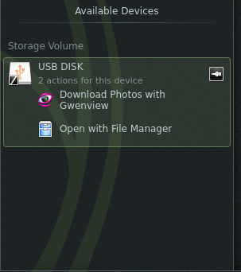

For example, if you connect a digital camera, you can download your photos with Gwenview (image viewer) or digiKam (image management program). Click on the device entry in the widget to access the available actions. To securely remove the device from the computer, click on the icon to the right of the device entry (the cable icon or the eject button).
###5. Adapt Your Desktop

You can tailor the appearance and behavior of your KDE desktop to your personal requirements.
####5.1 Fixing and approving desktop objects

Desktop elements can be fixed in the current position to prevent them moving to and from on the desktop. This does not affect the program windows, but only elements which are directly on the desktop such as the widgets or program icons. When the desktop elements are fixed, no objects can be added to the desktop, moved or removed.

Click on the Cashew icon (toolbox) in the top right of the desktop to fix or release the desktop elements and select *Lock widgets* or *Unlock widgets*.

Alternatively, right-click on an empty space on the desktop and select *Lock widgets* or* Unlock widgets*.
####5.2 Changing individual desktop elements

In the following sections you will find some examples of how individual desktop elements can be changed.

**Procedure 2.1: Adding program icons to the desktop **

Proceed as follows to create a link to an application and to place it on the desktop or the control bar:
1.	Click on the *Main Menu* and search for the desired application.

2.	Right-click on the *Add to desktop* option in the displayed context menu to select it. If this menu entry is not available, your desktop elements are probably fixed. Release these first, as described in Section 2.5.1, “Fixing and approving desktop objects”.

3.	To change the position of icon symbol on the desktop, click on the icon with the left mouse button and drag it to the desired location.

If you want to delete an icon from the desktop, right-click on the program icon and select Remove icon.

**Procedure 2.2: Adding widgets on the desktop or on the control bar **

1.	To add widgets to your desktop.  Right-click on an empty space on your desktop and select *Add widgets*.

    To add a widget to your control bar.  Right-click on an empty space on the control bar and *select Control bar Settings › Add widgets*.

    If these menu entries are not available, your desktop elements are probably fixed. In this case, first right-click on the control bar and select* Unlock widgets*.

2.	Select a widget from the displayed list. Search through the available widgets with the help of the scroll bar. To restrict the selection of widgets either input a search term in the input field or select a category.

3.	To display the selected widget on the desktop or on the control bar, click it with the left mouse button, keep the button depressed and drag the symbol to its envisaged position. Then release the left mouse button again. The mouse pointer turns into a prohibited symbol in locations where it is impossible to place the widget.

4.	To remove a widget from the desktop or the control bar, right-click on the widget and select *Remove.*...

**Procedure 2.3: Configuring widgets**

1.	Hold the mouse pointer over a widget until a translucent frame appears around the widget which displays a row of icons:
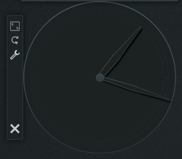

    If the frame does not appear, your widgets are probably fixed. Release these first, as described in Section 2.5.1, “Fixing and approving desktop objects”.

2.	To change the size of the widget, click on the ruler symbol in the frame with the left mouse button and keep the mouse button depressed while you slowly move the pointer over the desktop.

3.	To rotate the widget in one direction, click on the curved arrow symbol in the frame with the left mouse button and keep the mouse button depressed while you drag the mouse pointer in a circular motion over the desktop. There is a locking limit on the horizontal and vertical positions to which you can “affix” the widget if necessary. Of course, you can also place it in any appropriate position.

4.	To change the content, the settings or the properties of a widget, click on the cogwheel icon in the frame with the left mouse button. Determine the options as desired in the configuration dialog box which is now displayed.

panels are available to gain more space for your own programs.

**Procedure 2.4: Adding and removing panels **

1.	Right-click on an empty space on the desktop, select *Add panel*, and a panel type from the list.

    If these menu entries are not available, your desktop elements are probably fixed. In this case, first right-click and select *Unlock widgets*.

2.	Click on the Cashew icon at the end of the new panel to access the configuration options and adapt the panel as described in Procedure 2.5, “Configuring panels”.

3.  To delete a panel, right-click on an empty space in the panel for deletion and select *panel Settings › Remove "panel”*. At least one panel must remain on the desktop in openSUSE.

**Procedure 2.5: Configuring panels**

Applications and widgets can be added in the main panel or other panels. panel elements and other panels can be shifted to different positions or removed if necessary.

1.	In order to access options for the current panel, right-click on an empty space in the panel and select *Settings for panel › panel settings*. It is quicker if you click on the cashew icon at the very right of the bar. In any case, the view of the panel changes and the configuration options are displayed.
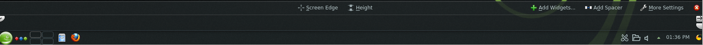

    If the menu entry and the icon is not available, your desktop elements are probably fixed. To unlock, first right-click on the panel and select Unlock widgets.

2.	In order to move objects in the panel to another position in the panel, point to the desired panel object with the mouse cursor (e.g. program icon, desktop toggle, task manager, system section for panel). The mouse pointer takes the form of a cross. Click on the object and drag the element to the desired position in the panel. Click again to fix it in this position.

3.	To increase the distance between two widgets, use *Add spacers*. A spacer widget is displayed on the right hand side. Drag it to the preferred location and leave it there.

4.	To change the width of the panel, click on the small arrow icon on the left and right hand side of the settings panel. With the arrow on the left hand side you can determine the position of the panel and with the arrows on the right hand side you can determine the maximized and minimized size.

5.	To change the height of the panel, left-click on the *Height* button and drag to the desired final position.

6.	With the help of the Screen *edge* button, position the panel on one side of the screen. Drag the panel into the desired position using drag and drop.

7.	If you need additional widgets in your panel, you can add them using the *Add widgets* button as described in Procedure 2.2, “Adding widgets on the desktop or on the control bar”.

8.	To remove program icons or widgets from the panel, right-click on the object in question and select the menu entry to remove the icon or widget.

    The icons in the system section of the panel normally belong to applications which are executed in the background. You can therefore only remove these icons once you have closed these applications (click on the icon and select *End*).

9.	Further configuration options (e.g. orientation) and further functions (e.g. automatic masking) can be found under *Advanced settings.*

10.	When all panel settings meet your requirements, close the panel settings with the red button on the right hand side.

**Procedure 2.6: Changing the Desktop Background **

You can set the desktop background in such a way that images, slide shows, samples or colors are displayed. Even a world map or the weather forecast can be used as a desktop background.
1.	Right-click on an empty space on the desktop and select Default desktop settings. A configuration window is opened.

2.	In the View section select a type from the Background image dropdown list. Further configuration options are dependent on the object you have selected for the *background*.

3.	In order to use an image as a background, proceed as follows:
    a.	Choose the *Image option* under Background image.
    b.	Define the *Positioning* of the image.
    c.	Use one of the available background images by selecting the desired background in the list, or click on *Download new background images* to obtain further background images from the Internet.
    d.	To use a user-defined image, click on *Open* and select an image file from the file system.
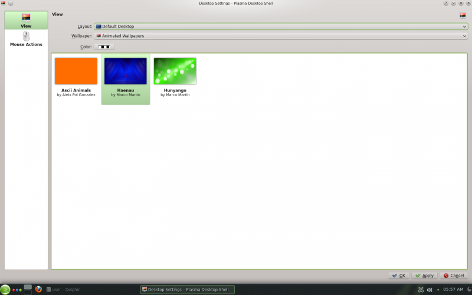

4.	Determine the other options in the configuration dialog box according to your wishes and click on *OK* to save your changes and close the configuration dialog box.

####5.3 Modify personal settings
Apart from changing individual desktop elements, you can adapt your desktop with KDE to your precise requirements. Options for adapting the entire appearance and behavior of your desktop can be found in the *Configure desktop* configuration dialog box.

Launch *Configure desktop* in the *Main Menu* by selecting *Favorites › Configure desktop*.

The settings are sub-divided into different categories. Hover the mouse on an icon to see further details. You need system administrator rights for some tasks in Configure desktop (root).

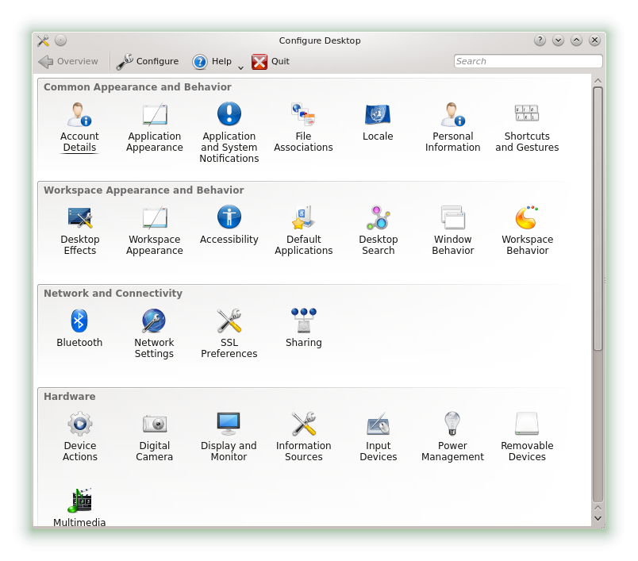
Change the settings as desired. Changes only become effective when you click on *Apply*. Click on *Restore* to discard changes in the last view which have not yet been applied. In order to restore all elements in the last view to standard values, click on *Default settings*.

To return to the initial display (with all categories), click in the top left of the dialog box *on Overview*. You can also input search terms at the top of the window (for example *Screensaver*) to find the category which contains options that match the search text. Each character you enter in the Search field further restricts the *search*. The icon of the category found is highlighted in a different color.

For a more simple overview of all categories, you can change to a tree view by clicking on Create and selecting a different *View design*.

###2.6  Application of Desktop Effects

If your computer supports a 3D graphics card, you can use graphic effects, such as converting the desktop to a rotating 3D dice, activating translucent or transparent windows or maximizing and minimizing the desktop screen. You can also use other window effects such as Shadow, Blending in and Remodeling. If you do not have a 3D graphics card, some effects may be disabled or can slow down your system. If your system is too slow, disable the effects for the current session by pressing `Alt`–`Shift`–`F12`.

Configure the effects of your desktop as follows:
1.	Start the *Configure desktop* as described in Section 2.5.3, “Modify personal settings”.

2.	Select *Desktop effects* from the *Desktop appearance and behavior category*, and select Activate desktop effects upon system start. If your graphics card does not support the 3D function, you are notified accordingly.

3.	Optional: Change some options under *General settings* on the *Advanced tab*.

4.	Select the effects to be activated on the* All effects tab*. When you click on the information icon, a short explanation on the respective effect is superimposed. If an effect is activated, you can obtain access to further configuration options with the cogwheel icon (right), for example to assign keyboard shortcuts for the effect.

5.	With *Apply* you can activate the effects permanently.

###2.7 Use of Virtual Desktops

The desktop environment enables you to organize your programs and tasks on several virtual desktops. If you often run a lot of programs simultaneously, this minimizes the number of windows to arrange on your screen. For example, you can use a desktop for e-mails and the calendar and another desktop for text processing or graphic applications.

**Procedure 2.7: Moving an application to another virtual desktop **
You can display a currently executed application on one or all virtual desktops or move them to other desktops.
1.	Open the application.
2.	Right-click on the title bar of the application.
3.	Click on On *Desktop*.
4.	Select the desktop where the application should be placed.
5.	Click on the desired desktop in the desktop toggle switch in the control bar in order to change to a certain desktop. Change to the next or previous desktop by placing the mouse pointer in an empty space on the desktop and moving the mouse wheel.

**Procedure 2.8: Configuring the virtual desktop **

You can increase the number of virtual desktops, change standard names, assign activities, configure effect animations and assign keyboard shortcuts to switch virtual desktops.

1.	To add additional desktops, right-click on the desktop toggle switch in the control bar and select *Add virtual desktop*. A new desktop is displayed in the desktop toggle switch.

2.	If configuration options are available, right-click on the desktop toggle switch and select *Desktop toggle switch settings*.
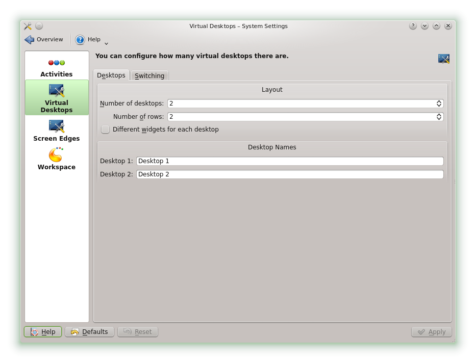

3.	You can configure the appearance of the desktop toggle switch in the control bar with the options in the *General* category.

4.	Desktop names, key combinations to change between desktops, and the switchover type can be configured in the *Virtual Desktops* category.

5.	Determine the desired options and click on *OK*. The changes are adopted and the configuration dialog box is closed.

###2.8 Management of files and folders

In KDE 4, Konqueror has been replaced by Dolphin as a standard file manager. Konqueror will continue to be used as a web browser (information regarding this can be found in Section 2.9, “Browsing on the Internet”). Start Dolphin in the main menu by selecting *Favorites › File manager* or pressing `Alt`–`F2` and entering dolphin.

####8.1 Dolphin main window

The Dolphin main window consists of the following elements:

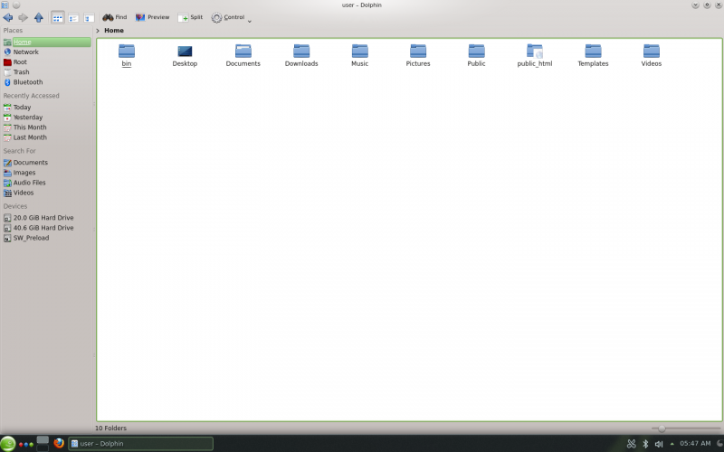
**Menu bar:**  Call the main menu up via the cogwheel icon. All possible functions are ready there, such as copying, moving or deletion of files, changing view, starting of further tools, changing settings and calling up help.

**Symbol bar:**  The symbol bar accelerates the navigation and changing of the display. The relevant functions can also be called up via the main menu. If the mouse pointer is positioned over an icon for a moment, a short description of the icon is displayed.

**Address bar:**  The address bar displays the path to the current directory. It is available in two versions: one displays the path to the current directory with buttons for each superordinate folder. Click on a directory name in this view in order to change to this directory. The second version of the address bar displays the path to the current directory as a text chain which can be edited.

**Fields:**  The Places sidebar is displayed in Dolphin as standard. It enables rapid access to frequently used places such as your home directory, the root directory of the file system (/), the Recycle Bin, and removable media. You can add further different control bars in the main menu under *View › Side bars* .

**Display field (work area):**  The content of the selected directory or the selected file is displayed in the display field. Dolphin shows the content of your home directory as standard at the start. By clicking on a folder in Dolphin an action is started directly as standard: Dolphin loads the file into an application or opens the folder for further processing.

**Status bar:**  Shows the file type and the size of the currently selected object and enables maximization and minimization of the icons or entries in the display field via the slider.

####8.2 Management of folders and files in Dolphin

To perform actions such as copying, moving, creating or deleting files, you require the relevant rights for the respective folders and files.

To copy, move or delete a file or a folder proceed as follows:
1.	To select one or several files and folders in Dolphin move the mouse pointer over the file or folder, but do not click on it. A green cross appears on the left upper edge. The object is selected when you click on it. To clear the selection, click on the red minus sign which is displayed when the object is selected.

    Alternatively, press `Ctrl` and click on the objects which should be selected or unselected.
2.	Right-click and select Copy or Cut in the context menu.
3.	Navigate to the target folder where you wish to insert the object.
4.	To create a new folder at the current location, right-click in the display field and select *Create › Folder* or press `F10`. Enter a folder name in the new window and press `Enter`.
5.	In order to insert the copied or cut object in Step 2, right-click on the target folder in the main display field and select Insert. The object is copied or moved into this folder.
6.	To delete a file or a folder, right-click in the main display field on the object and select Send to Recycle Bin in the context menu. The object is moved to the bin. You can retrieve it from there or permanently delete the object if necessary.

In order to quickly filter for certain file names in the current directory, press `Ctrl`–`I` to add the Filter input field at the bottom of the Dolphin main window. Enter any part of the file name for which you are searching to see all files in the current directory which contain the chain of characters searched for. Press `Ctrl`–`F` to use the desktop search for detailed and advanced search. You can find further information on this in Section 2.15, “Search for data (with Strigi)”.

####8.3 Configuration of Dolphin

Dolphin offers many options for changing the view and the options as a whole to suit your preferences.

**Procedure 2.9: Changing the view **

1. To change from standard view to the editable version of the address bar, press `F6`. Enter a path to a directory. After inputting an address, press `Enter` or click the green hook on the right adjacent to the input field.

    To delete the content in the address bar click on the right on the black X icon. To change back to the standard view, press `Ctrl`–`L`.
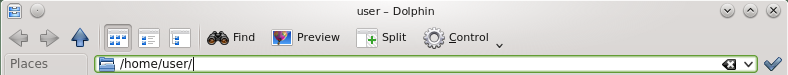

2. To change the view of the currently displayed folder click on one of the relevant icons in the icon bar (fourth, fifth and sixth from the left). Dolphin retains the selected view for each folder. Press `F3` to display the content of the current folder in two separate columns. You can now navigate to a different directory in each column and easily drag or position objects or compare the contents of directories. Press `F3` again to close the split pane.
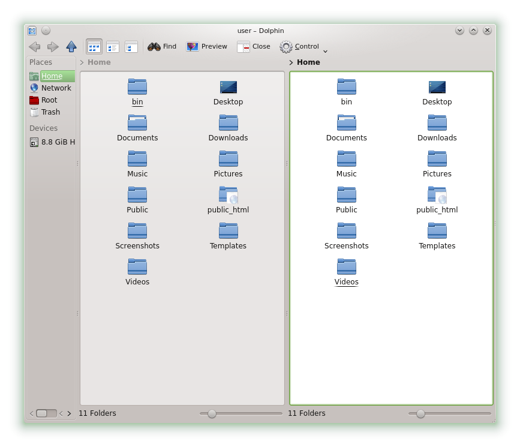

3. If you want Dolphin to display hidden files, click on the cogwheel icon to open the main menu and choose Show hidden files. (If you have enabled the menu bar, instead use *View › Show hidden files*.)

4.	To display further details on the files (such as access rights or ownership), select *Additional Information* in the main menu behind the cogwheel icon and activate the relevant options.

5.	To add further directories to the *Places* sidebar, drag a folder from the desktop into the* Places* sidebar and position it there Right-click on the context menu and use it to hide, edit, or remove entries from *Places*.

6.	To add further sidebars to the main window, select Sidebars behind the cogwheel icon in the main menu and then further sidebars such as Folders or Terminals.

Separate the sidebars from Dolphin’s main window by clicking the name of the sidebar and then dragging it to another location on the desktop. If the sidebar has no title it is locked. In such a case, right-click in a free area on the sidebar and then select Unlock sidebars. to integrate the sidebar into Dolphin’s main window again, double-click on the name of the sidebar again.

**Procedure 2.10: Changing the overall behavior of Dolphin **

To change the behavior or the view of Dolphin as a whole, select Configure dolphin in the main menu behind the Cogwheel icon and view the options offered in Dolphin’s configuration catalog.

1.	If a certain view mode should apply to all folders, click on General in the left sidebar and activate *Use common properties for all folders*. Click on Views in the left sidebar and adapt the options for the different views. Click on *Apply* to save the changes.

2.	If Dolphin displays another directory on startup, or if you want to use the editable address bar constantly, click on Startup in the left sidebar and change the relevant options.

3.	To configure the entries and services displayed in Dolphin’s context menu, click on *General*. Activate the entries to be displayed on the *Context menu* tab. Click on Services in the left sidebar and *activate* or *disable* the relevant services to be displayed in the *context menu*.

4.	Click on *OK* to accept the changes and close the Dolphin configuration dialog box.

###2.9 Browsing on the Internet

Apart from Konqueror (the standard KDE web browser) openSUSE also contains the Firefox web browser. To start Konqueror or Firefox, press `Alt`–`F2` and enter konqueror or firefox.

Both browsers offer support for modern web standards, the use of tabs, a pop-up blocker, and download and image management. Simple access to different search engines helps you in searching for required information.
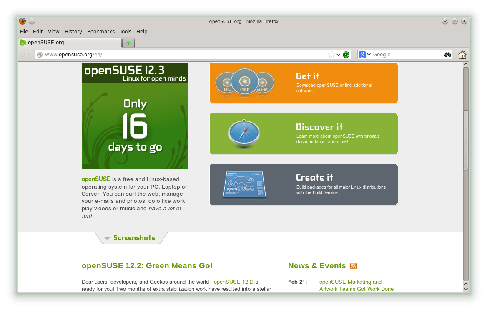
Enter the URL in the address field to start browsing. Press `Ctrl`–`T` to open a new, empty tab. To open a link in a new tab, click on the link with your middle mouse button. When you right-click on the tab, a menu with tab options is superimposed. This menu allows you to create new tabs, reload the content of a certain tab or all available tabs and close tabs. You can also change the sequence of the tabs by dragging it to the desired position and leaving it there.

####9.1 Finding Information

Firefox offers two different types of search options: You can search for information on the web or on the current webpage using certain terms.

**Procedure 2.11: Searching the web **

1.	To start a search on the web, click on the left icon on the right of the search bar (adjacent to the places bar) to open a list of search engines.

2.	Select the desired search engine and enter your search terms into the input field.

3.	Press `Enter` to start the search process.

4.	If you want to search the current webpage with Firefox or Konqueror, press `Ctrl`–`F` to display a search bar at the bottom of the window. Enter your search term there and start the search with the buttons below the search bar in different directors or configure the search options, for example Upper/Lower case.

Konqueror offers predefined web key combinations to quickly search the web. To search for yast, for example, on the web using the Google search engine enter gg:yast in Konqueror’s address bar (or the Execute command dialog box) and press `Enter`.

You can also define individual Web key combinations in Konqueror and Firefox as described in Section 2.9.3, “Configuring Preferences”.

####9.2 Downloading Files from the Web

When you download a file with Firefox or Konqueror, a dialog box is opened in which you are requested whether you want to save the file or open it with a certain application. Also specify whether the selected action should apply to all files of this type. Firefox saves the file in the folder configured in the Firefox settings as standard and shows the completed downloads in the *Downloads* dialog box.

To open the downloaded files directly from there, right-click on Open to select the option. To clear the history of downloaded files, click on *Empty list*.

####9.3 Configuring Preferences

Changing the settings in Konqueror or Firefox. Access the configuration dialog box in Konqueror by selecting *Settings › Configure Konqueror*. To change the behavior of Konqueror as a web browser, select one of the sub-categories in Surfing the Internet in the left navigation area to display the options for the relevant category. For example, you can “hide” the true identity of Konqueror and identify Konqueror as another browser (such as, Internet Explorer*) for certain websites you visit. To do so, select* Browser identification* and click on New in order to add a new, page-specific identification.
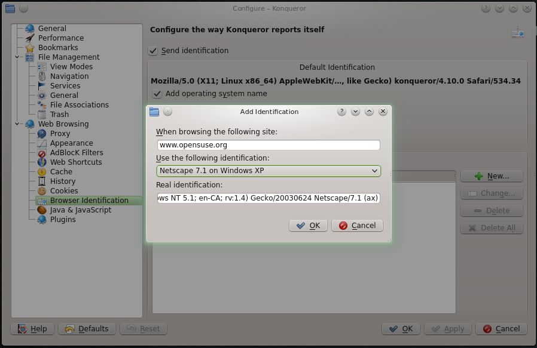

Perhaps you would also like to configure the web key shortcut you can use with Konqueror (and the *Execute command* dialog box). Click on Web shortcut in the configuration dialog box of Konqueror to display the currently defined key shortcut. Click on New to define new key shortcuts. Press OK to *close* the configuration dialog box of Konqueror and apply the changes.

Select Edit  › Preferences in Firefox to open the Firefox settings. Click on the symbols in the upper display field in order to access the options for the relevant category. For example, change the standard download folder on the General page or change the blocking of pop-up windows on the Content page. Click on Close to accept the changes.

Navigate to the website with the desired search field to configure a web key combination for a search in Firefox. Right-click on the search field and select *Add keyword for this search....* Enter a Keyword and close the dialog box by pressing *OK*.

###2.10 Managing Passwords

When you input a password in a KDE application for the first time (for example in KMail or in Konqueror), you are asked if you want to save the password. If you click on Yes, the KWallet assistant starts as standard. KWallet is a password management tool which can collect all passwords and save them in one or more encrypted files (so-called “Wallets”).
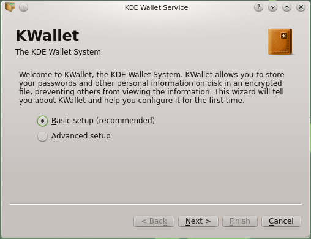

To activate the KWallet, select Basic set-up, and click on Advanced. Select Yes, I want to use the KDE digital wallet for my personal information. Then assign a master password to the standard wallet (kdewallet), which is created in the next step.

    **Warning: *Protect your password for KWallet***
    If you forget your master password for a wallet, this password can't be recreated. Also, everyone who knows your password can look inside your wallet.

Click on *Finish* to close the assistant. If you originally started the KWallet assistant via a different application such as Konqueror or KMail, you are requested in KWallet to re-enter the password so that the password can be saved in the newly created wallet for this application. After the first configuration you can open KWallet at any time to display, search for, delete or create entries. Entering passwords manually is not usually necessary. KDE recognizes when a resource needs to be authenticated and KWallet starts automatically and asks you to enter your KWallet password. However, you can also add additional data if you wish. To configure the KWallet options, press `Alt`–`F2` and enter kwalletmanager. The *Service program for digital wallets* is opened. If the window does not appear, take a look at the system section of the control bar (on the left adjacent to the clock). If necessary, expand all hidden applications via the small triangle. Then click on the *Service program* for digital wallets or on the relevant icon. The window of the application should then open. Select Settings  › Set up digital wallet.

While KWallet is set up in such a way that passwords for different KDE applications are managed centrally, Firefox also offers the option of saving data on a website when a user name and password are entered. When you accept this, by clicking on Save the password is saved on your hard drive in an encrypted format. Firefox fills out the registration errors automatically when this website is next accessed.

To verify or manage your passwords in Firefox, click on *Edit › Preferences › Security › Saved Passwords....*

###2.11 E-mail and Calendar

You can use Kontact as your personal information management (PIM) tool to read and manage your e-mails and events. Kontact combines KDE applications such as KMail, KOrganizer and KAddressBook in a single interface. This facilitates access to e-mails, calendar, address book and other PIM functions. Kontact can also manage several e-mail accounts.

####11.1 First time start-up of Kontact

To start Kontact press `Alt`–`F2` and `enter` Kontact. To access one of the components (e.g. KMail), click on the relevant icon on the left of the sidebar.
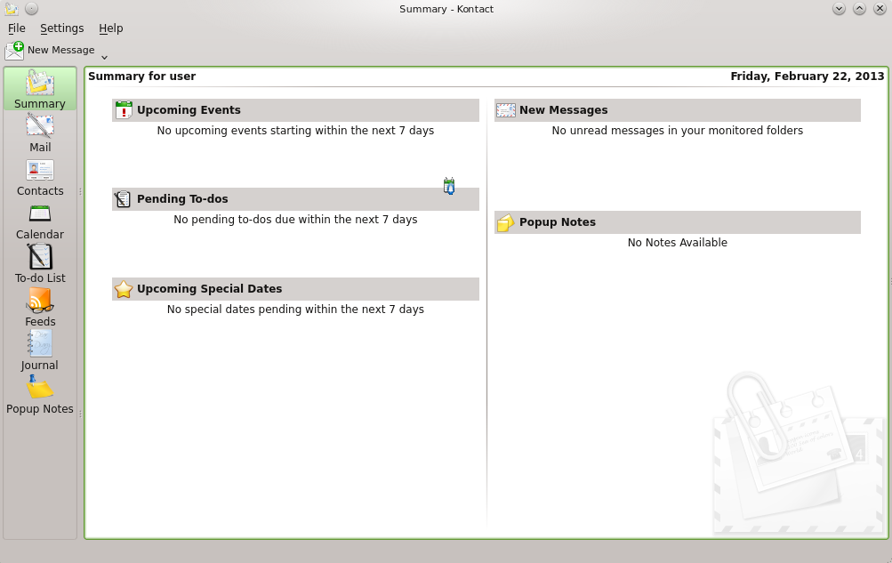

Before you can send or receive e-mail messages, you must configure an e-mail identity and an e-mail account:

1.	Select *Settings › Configure* Kontact.

2.	Click on *Identities* in the left sidebar under E-mail and select the identity KMail has automatically created for you. Change this identity by entering your full name and e-mail address and confirm your changes with OK.

3.	Click in the left sidebar under *E-Mail* on *Accesses* and select the *Add option* on the *Receiving* and/or *Sending* of e-mails tab to create at least one account. (Optionally, you can configure several e-mail accounts.)

4.	Select the type of access. To retrieve e-mails, this is usually *IMAP or POP3*. To find out the right values to use, please consult the help pages of your e-mail provider. Highlight the relevant entry in the list and click *OK*. KWallet reports now, to whom you name the (master) password for your wallet. Then fill in the form which appears. Dependent on the account, options must also be determined for encryption or authentication. If you are unsure which settings or objects you should search for, get in touch with your Internet Service Provider or your system administrator.

5.	Click on *OK*. Set-up is confirmed and the dialog box is closed.

To write a new e-mail in the main window of Kontact, click on the Mail icon and press `Ctrl`–`N` to open the E-mail Editor. When you have finished your e-mail, click on Send to send it straightaway. If you have configured several e-mail accounts, hold down the Send button and select the account to send the e-mail from.

###2.12 Instant Messaging with Kopete

Kopete is an online messenger application which enables you to chat with others over the Internet. Kopete supports many messenger protocols, such as AOL* Instant Messenger (AIM), Gadu-Gadu, GroupWise® Messenger, ICQ, Jabber, SMS, and Yahoo!. To use Instant Messaging (IM), you need to register with an IM services provider and then enter this data Kopete accordingly.

To start Kopete, press `Alt`–`F2`and enter kopete. When you start the application for the first time, *select Settings › Configure*. Add an Account here in the *Accounts area*. Kopete takes you through the set-up steps, such as selecting the news service, entering the necessary account information (for example, user name/user ID, server name, port), inputting of registration data (e.g. passwords). If you have not yet registered with the provider for the selected news service, click on *Register New Account*. Enter your user data into the browser window which is now opened to register. Change back to Kopete and enter the data received upon registration. Close the configuration of your account by clicking on *Finish*.

If you want to go online after configuring your account, you can now add contacts in the main window of Kopete. When the status Offline is displayed in the Kopete window (in the status bar), first click on *File › Set status › Online* and enter your password as soon as you are requested. When connected, click on *File › Add contact* and select the Kopete account for which contacts should be added. Enter the contact data or search for a contact and click on *OK*.

To display all contacts, even if these are currently offline, *select Settings › Show Offline Users*.

When you want to start a chat, click on the desired contact and enter your message into the lower section of the chat window. Press Enter to send the message. The upper part of the window displays the messages you have sent and received.
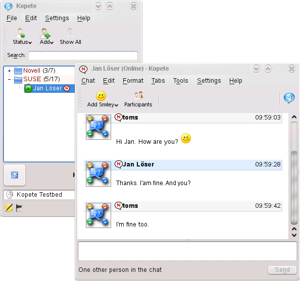

###2.13 Starting LibreOffice

The office suite LibreOffice offers a comprehensive set of office tools, which includes a text processor, a spreadsheet application, a slideshow application, a vector graphics program and a database application and more. As LibreOffice is available for a range of operating systems, you can seamlessly use files created with it on different platforms.

Press `Alt`–`F2` to start and enter libreoffice. When you want to create a new document, select *File* › *New* and then select the desired document type. To open an existing document, click Open and select the relevant file from the file system.

You can find further information in LibreOffice Quick Start.

###2.14 Viewing PDF Files and Other Documents

Documents which need to be approved or printed on several platforms can be saved as PDF (Portable Document Format) files, for example with the LibreOffice-Suite. Display these documents with Okular, KDE’s standard document display.

####14.1 Using the Okular document display

Apart from PDF files, you can display a multitude of file formats with Okular, such as PostScript, different image formats, the OpenDocument Format (ODF), some eBook formats (ePub) and even Microsoft* Compiled HTML Help (CHM). Okular also supports bookmarks, comments, formula fields and multimedia contents as well as page rotation.

Start Okular in the Main Menu or press `Alt`–`F2` and enter okular.

To open a document select *File › Open* and select the relevant file from the file system. Navigate through the document with the up or down navigation icons in the window. According to which icon you click on the left side of the navigation area, the sidebar either shows the Content, *Preview images* of all pages, the *Reviews* or your *Bookmarks* for this file. To filter for text which is listed in the sidebar or in the entire document, enter a string of characters into the input field at the top of the sidebar. If you want to select and copy a text or images from the file in Okular, click on the *Select* icon in the toolbar and select one of the options from the context menu. Click on the *Browse* icon to return to browsing the document.

**Procedure 2.12: Working with bookmarks and comments **

With Okular you can verify a document by emphasizing certain passages of text or adding comments or bookmarks which Okular then adds to the file in the form of metadata. Note that the added comments and identifiers cannot be saved in the document. Consequently, it is not possible to print them or forward them to other users.

1.	To add a bookmark to a page click on the relevant page in the sidebar or in the main display field and click on `Ctrl`–`B`. The page is added to the list of Bookmarks in the left sidebar. Right-click on the bookmark entry to access a context menu in which you can change to this bookmark, rename it or remove it.

2.	To create a comment for a page, press `F6` and select one of the comments tools from the toolbar now displayed. The comment is added to the list of *Reviews* and identified with the sign-in name of the user who created it. Use the symbols at the bottom of the sidebar in order to group the comments by page or author or to display only the comments for the current page.

3.	To open a pop-up note and add a text for a comment (or to remove a comment), right-click on the comment entry in the list of *Reviews* and select the relevant menu entry. The comments or identifiers added are automatically added to the file and you do not need to save these.

####14.2 Using Acrobat Reader

If Acrobat Reader is not installed as standard, install the acroread package with YaST. To start Acrobat Reader, press `Alt`–`F2` and enter acroread. Click on File › Open, search for the desired PDF file and click on Open, to display the file.

###2.15 Search for data (with Strigi)

The Strigi desktop search not only searches for files, but also for metadata such as tags, evaluations and even source URLs for downloads. To use *desktop search*, the nepomuk service must be executed. To activate this service, open Configure Desktop, switch to Desktop search, tick all services on the *Basic Settings* tab and terminate the dialog box by clicking on *Apply and OK*.

After activation, you can use KRunner (`Alt`–`F2`) to search for files by inputting a keyword. An advanced search interface is available in the Dolphin file manager. Press `Ctrl`–`F` in Dolphin to activate the desktop search. You can filter the search *results* by File name, *Content or place*.

###2.16 Creating a CD or DVD

If your computer has a CD or DVD burner, you can burn K3b files on CD or DVD. To create a data CD or DVD, proceed as follows:

1.	Press `Alt`–`F2` and enter k3b. K3b is opened.

2.	In the main menu select *File* › *New Project* › *New Data Project*.

3.	Use the tree view in the upper left section of the window to search for the files or folders to be burnt to a disc. As soon as this is displayed in the top right of the window, drag it into the window using *Current projects*.
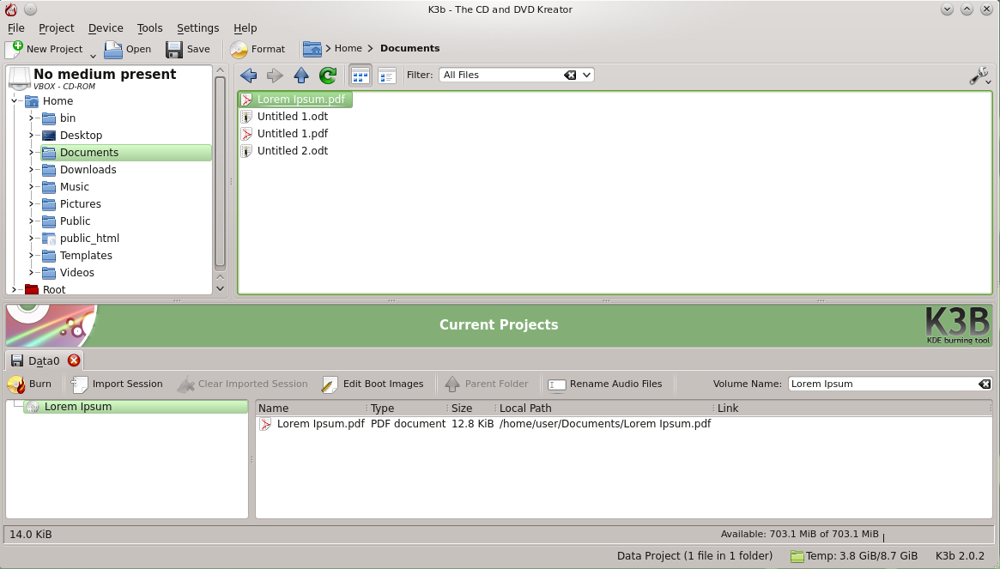

4.	Place a writable CD or DVD into the device and then click on the *Burn icon*.

5.	Check the settings on the *Burn tab*. The standard settings should normally work for almost all files. If desired, you can also change further options, such as *Data medium name*, on the *File System tab*.

6.	Click on Burn.

###2.17 Manage your collection of digital images

With digiKam, it is easy to manage digital photos: Download your images from the camera, edit and optimize them, arrange them in albums (or add identifications for simple retrieval, regardless of folders or albums) and archive them on CD or DVD or export them into a gallery with web images.

digiKam also contains a set of useful stacking functions and plug-ins which enable you to convert several images into different formats, rename them or automatically improve the quality of images with the help of functions such as red eye correction, retouching and Hot Pixel removal. Different plug-ins for filters and effects help you to make your digital photos into works of art.

To start digiKam, press `Alt`–`F2` and enter digikam. When you start it for the first time, the first time start assistant opens which will guide you through setup. In general, you can confirm all questions with Next.
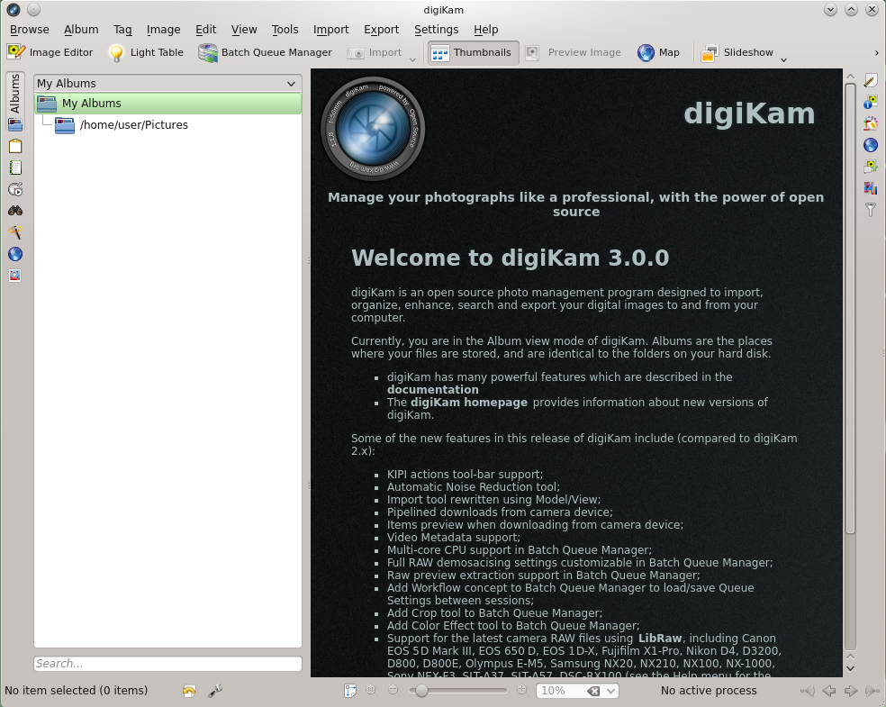

The main window of digiKam contains a tree view on the left hand side and displays thumbnails of the images on the right hand side. To access your images quickly, use the sidebar on the left side which enables you to switch between the different views and to sort the photos according to the *Albums* or *Keywords* for example. To change to the display and editing mode of digiKam, double click on the thumbnail of a photo.

###2.18 Managing your music collection

With KDE’s Amarok Music Player you can play back different audio formats, create playlists, listen to streaming audio broadcasts on radio stations on the Internet and subscribe to podcasts. The file types supported vary dependent on the Amarok module used.

To start Amarok, press the `Alt`–`F2` key and enter amarok.On the first start you have to select the folder which should be searched for your music files. If you want to use the suggested file, simply click on Yes.
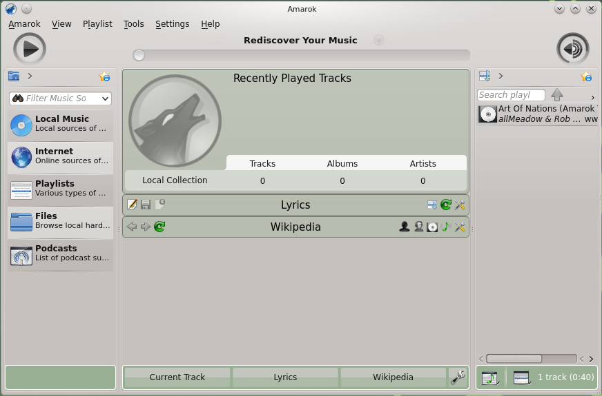

A sidebar with different views is displayed in the main window of Amarok: your local music collection, some addresses for playing back podcasts or streams from the Internet, your playlists and a file browser. In the middle section, the context browser, information on the current title, the Wikipedia page for interpreters and the song text is displayed as standard. You can see the current playlist in the right hand section of the window. To do so, drag the desired elements from any browser of the sidebar into the area for the playlists. To play back an element, *double-click on it in the playlist*.

If your music files have the correct identifiers (and contain at least information on the artist and the album), different useful functions of Amarok are available to you. To automatically retrieve images from Amazon for the album cover, select *Tools › Cover management* and click on Fetch missing cover. The next time you play back a piece of music from this album, the cover is displayed in the context browser and on the display. For further information on the artist, click in the *middle section* on the Wikipedia button Amarok will then start searching for the relevant Wikipedia article.

To configure the use of another module (or other Amarok functions) select *Settings › Configure* Amarok.

###2.19 Ending Your Session

Log out (so another use can use the computer next), restart the computer or shut it down.

####19.1 Log out or change user

Click on the Main Menu button in your control bar and select *Leave › Log Out*. This ends your session but the system remains active. To start a parallel session as a different user, instead select the option *Leave › Switch User*.

####19.2 Restart or shut down the computer

Click on *Leave* and then select one of the following options:

***Sleep:*** Only available if the computer supports energy management functions. Puts the computer into sleep mode without logging the user off. All data and the session data are stored in the main memory.

***Hibernate***: Only available if the computer supports power management functions. Puts the computer into sleep mode without logging the user off. All data and session data are stored on the hard drive before the system goes into hibernation. This protects the data from being lost if a power failure occurs in the meantime.

***Restart:*** Restarts the computer.

***Shut down***: Logs you out of the current session, then turns off the computer.

###2.20 For More Information

You can also find more information on KDE and KDE applications at [KDE ](http://www.kde.org/) and [ KDE APPLICATIONS](http://www.kde-apps.org/).

