## GNOME Quick Start

openSUSE® provides the tools required by Linux* users for their daily activities. It has a user-friendly graphic environment (the GNOME Desktop), which communicates with the Linux base system and allows access to files, folders, and programs, as well as their management. openSUSE provides an integrated suite of applications for a wide range of office, multimedia, and Internet activities. It also contains the LibreOffice Suite which enables editing and saving of files in a variety of formats. The office suite is available for several operating systems, meaning you can use the same data across different computing platforms.

###1 Getting Started

When starting up your system, you will normally be asked to select your user name and enter your password. If someone else installed your system, ask your system administrator for your user name and password.

The GNOME desktop appears after you first log in. Its appearance depends on whether openSUSE® could activate the 3D functions of your graphics card. Optics and functionality in both cases are the same, only the operation differs slightly.

###2 The standard GNOME desktop

If openSUSE® could activate the 3D functions, the GNOME desktop notifies you. The largest part is taken up by the initially still empty desktop with the green background image. You will see a narrow black bar on the top edge of the screen. This so-called panel allows you to access all functions and applications. Specifically, it has the following elements:
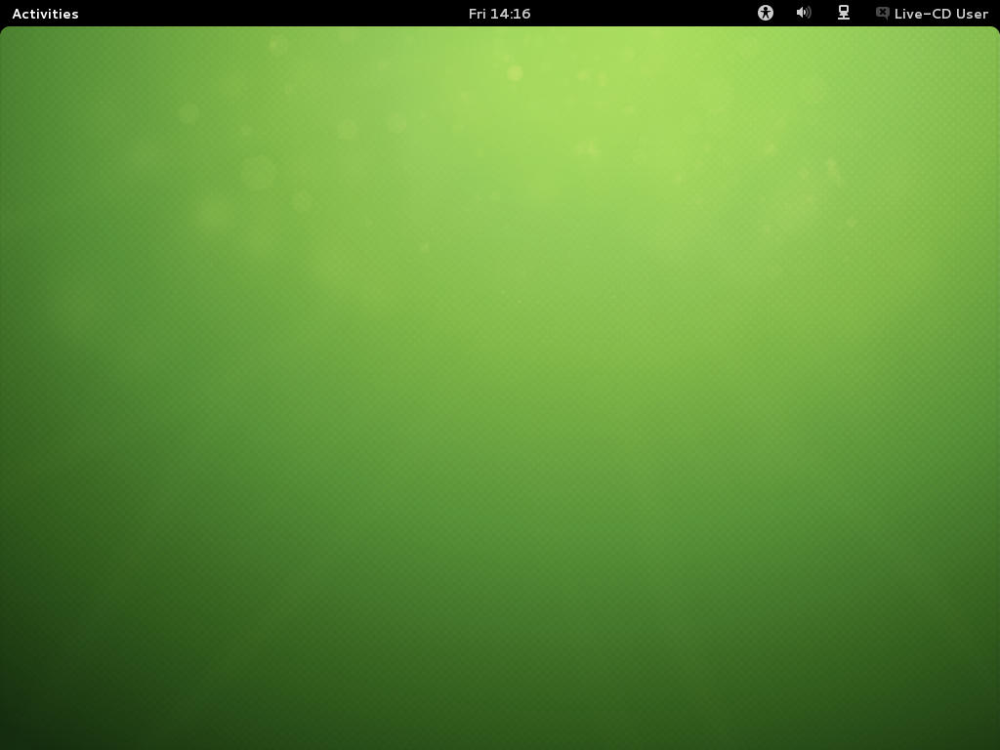
Time, calendar, and schedule planner:  The current time is ticking in the middle. When you click on it, a small calendar appears which lists all pending appointments and events on the right hand side. You can call up time and date settings via the relevant buttons or start the calendar application directly (Open calendar).

**Settings for accessibility:**  Clicking on the icon with the stylized little man opens different settings for accessibility. You can, for example, increase the contrast, switch on a screen keyboard or enlarge the font. To activate one of the functions, you must only right-click beside the slide switch. An illuminated blue i marks a currently active function. Further settings for accessibility are behind the similarly named point.

**Volume:**  The icon with the loudspeaker represents media volume. The more semicircles you can see, the louder your loudspeaker becomes. You can adjust the volume by clicking on the icon and dragging the white slider which appears when you press down the mouse button to the left or the right. To silence the sound, push the control all the way to the left. A little cross will be added to the loudspeaker icon. You can find additional settings for audio playback via the Sound Settings under the control.

**Network:**  Clicking on the icon directly to the left beside the user name brings up a list with all network connections. The individual connections are sorted here according to their access type. For wireless connections (Wi-fi), small curved lines display the connection quality. A white lock icon indicates that use is only possible after entering a password. You enter it by clicking on the corresponding connection. Whether a connection is active at all and is used by openSUSE® is indicated by the illuminated blue I beside to the right. Click on the black switch in order to switch off a connection or explicitly switch it on again. If special settings for your hardware are needed or if problems appear, you can also quickly switch to Network Settings on the bottom edge of the list.
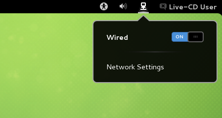

**User menu:**  If you click on your name on the top right corner, a menu appears where you manage your user profile and your computer. If you use the immediate news program Empathy, you can change your availability status directly below your name. You can turn off the status messages with the switch underneath. This is useful if, for example, you want to concentrate on your work. You can save your access data for Google and Twitter under Online Accounts. You can reach the System Settings via the following menu points, where you can, for example, lock the screen for the duration of your lunch break, change to another user account, log off GNOME, or switch off the computer. You can also restart your PC via the last point. If openSUSE® can use the energy-saving functions of your computer, the last menu item is called Readiness. This is how you switch your PC to hibernate mode. To go to the Switch Off menu item, hold down the Alt button.

**Activities:**  Clicking Activities on the top left corner of the screen takes you to the so-called activities overview where you start programs and manage those already running. You also reach this view by placing the mouse pointer on the top left corner of the screen or pressing the Windows key (also called the Super key). You return to the normal view by clicking on Activities.

**Notifications panel:**  Whenever you insert a flash drive, finish downloading or some other important thing happens in your system, a corresponding message appears on the bottom edge of the screen. Some of these messages disappear quickly by themselves, others offer equally suitable actions. You can, for example, eject an inserted data CD immediately or open your content in a new window. If you do not wish to do any of the actions, simply click on the title of the message and it will then disappear from the bottom edge. Some messages deliver only a fragmentary short text. To find out more, slide the mouse pointer over the message and it will then expand completely. You can retrieve messages which have been clicked away or which have disappeared too early by clicking on Activities in the top left and then hovering the mouse pointer in the lower-right corner of the screen for a few seconds. The so-called notifications panel then appears. Clicking on one of the messages saved there is enough to retrieve the list with the matching actions.

####2.1 Start Programs

To start an application, first switch to the activities view (click on Activities or press the Windows button). You now have three options:
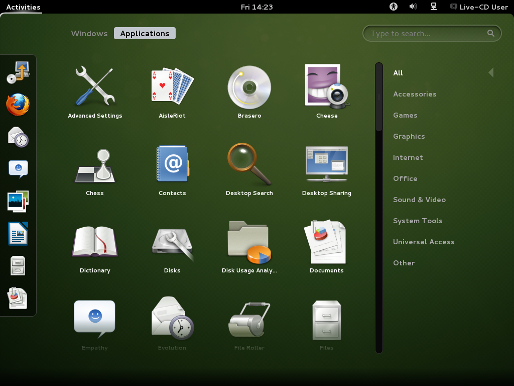

**About the Dash (Favorites bar):**  Either click on the program icon in the bar on the left edge of the screen, the so-called Dash (sometimes also inconsistently called a Dock). If you hover over one of the icons with the mouse pointer, GNOME will tell you the name of the pertaining application.

**Via the applications view:**  If the desired program is missing in Dash, click on Applications. GNOME will then show all the installed programs. You can move downwards in the list by pulling the ruler which is rather difficult to recognize in the narrow black bar slowly downwards with the left mouse button depressed. If you have installed a lot of programs or the list appears unclear to you, simply click on one of the categories on the right edge. GNOME then filters the diagram according to the corresponding field of application. For example, if you decide on the Graphics category, you see only all the available graphics programs.

**Via the search box:**  If you cannot find what you are looking for or when things have to get done quickly, the small search box on the right top will help. As soon as you enter a term there, GNOME will show all the matching applications and system settings. At the same time, you can also consult Wikipedia or Google via the corresponding buttons on the bottom edge. By the way, you do not have to click on the search box first, you can just simply begin typing directly.

####2.2 Manage Window

After you start an application, GNOME automatically switches back to the workplace. The name of the program and its icon appear in the panel. You can end the application by clicking on it. The X on the title bar of its window does the same thing.

**Procedure 3.1: Maximize Window **

To enlarge a window to the screen size, proceed as follows:

1.	Bring the mouse to the title bar of the window (with the program name) and hold and press the left mouse button.

2.	Pull the window on the top edge against the panel.

3.	As soon as GNOME turns the screen blue, let the mouse button go.

To minimize the window again, follow the same steps but vice versa: Using the mouse, pull away the title bar of the window from the top edge. Alternatively, you can also right-click on the title bar. A menu with the corresponding options then appears. But beware: Differently from other operating systems, Minimizing the window changes to Activities view.

You can switch quickly between open windows via the Ctrl–Tabshortcut. Activities view gives an overview of all currently open windows. You may need to first click to the Window area. Clicking on one of the windows brings it into the foreground, the X symbol closes it.
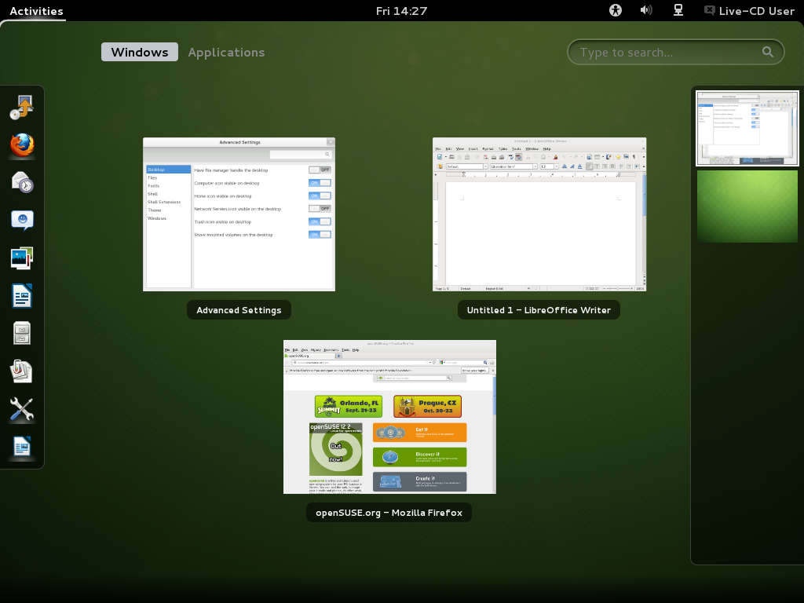

####2.3 Working with Dash

The small Dash in the Activities view not only keeps especially commonly used programs ready, but it can do even more: As soon as you start an application, an icon appears for it in the Dash. A light glow indicates that the application is running and (at least) one window is open.

Right-clicking on an icon opens a small menu which offers different actions depending on the associated program. With Add to Favorites, you can place the application icon permanently in Dash. To remove a program icon from Dash, select Remove from Favorites. If you wish to rearrange an icon in the dock, hold the left mouse button pressed above it and then drag it to its new position.

####2.4 Using Virtual Desktops

GNOME allows you to organize your program window into several virtual desktops. If you often run a lot of programs simultaneously, this minimizes the number of windows to arrange on your screen. You might, for example, use one desktop for e-mails and the calendar and another for word processing and graphics applications.

**Procedure 3.2: Move an Application to Another Virtual Desktop**

To move an open window to another virtual desktop, proceed as follows:
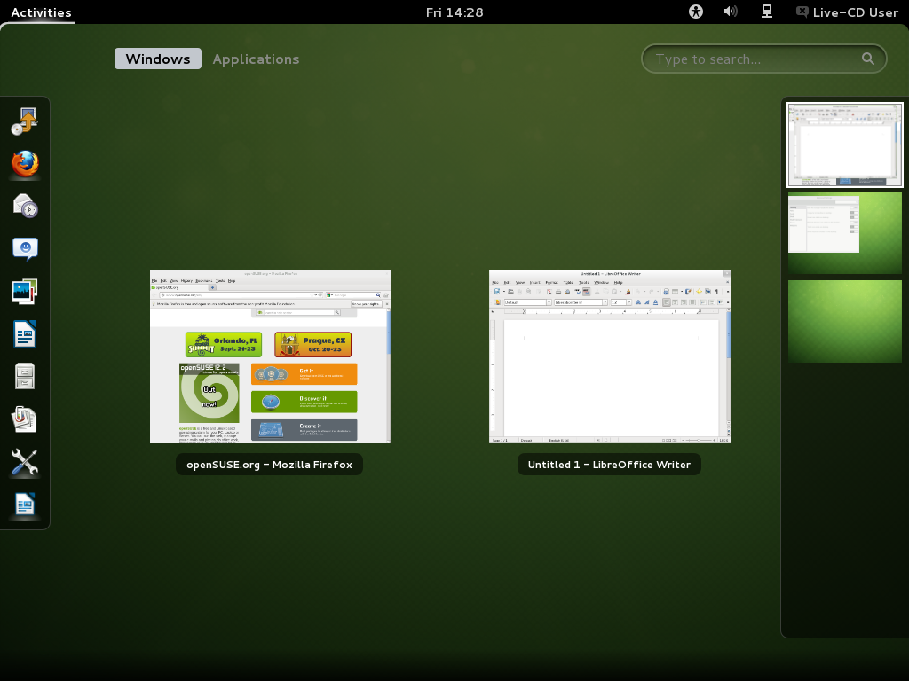

1.	Open the Activities view.

2.	Bring the mouse pointer to the corresponding window and drag it by pressing and holding the left mouse button on the right edge of the screen.

3.	A bar with all existing virtual desktops now opens there. Drag and drop the window to the desktop where you would like it to be.

4.	Release the left mouse button.

**Procedure 3.3: Switch Virtual Desktops **

You can switch between all existing desktops via Alt–Ctrl–Arrow up and Alt–Ctrl–Arrow down. Alternatively, you can also pull up the activities view:

1.	Open the activities view (for example, with the Windows key).

2.	Bring the mouse to the right edge of the screen. The bar with all existing virtual desktops opens again.

3.	Click on the desired virtual desktop on the bar. GNOME now shows all the windows that are there.

4.	Click on the virtual desktop once again to finally switch to it.

**Procedure 3.4: Show Window on All Desktops **

You can also show a currently open application on all virtual desktops:
1.	Right-click on the title bar of the application.

2.	Click on Always on the Visible Desktop.

3.	You can also very quickly move the window to an entirely specific desktop via the small menu. To do this, select Move to Another Desktop and then the corresponding desktop.

###3 Fallback Mode

If openSUSE® cannot find or activate any 3D graphics card in your computer, GNOME will start in the so-called fallback mode. After Closing the corresponding warning instruction, the GNOME desktop then appears with the following elements:
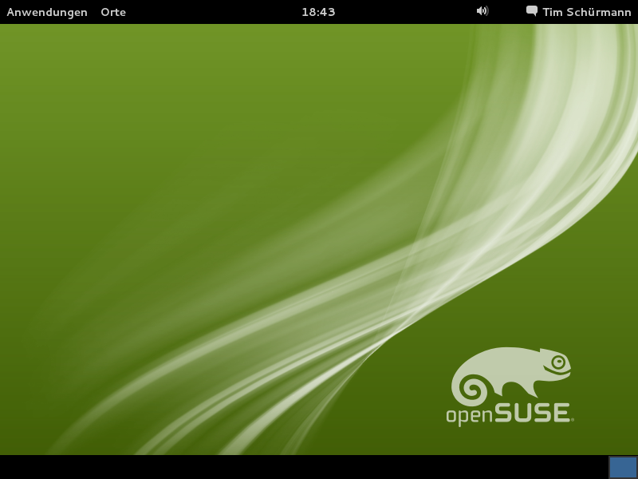

**Bottom Panel:**  The desktop includes a panel at the bottom of the screen. All applications currently open on the desktop appear here. You can access these applications by clicking on their name. Right-clicking on the icon in the bottom-right corner takes you to the virtual desktop's Settings. Provided you have created more than one, a single icon appears for every virtual desktop. In fallback mode, every window has three buttons in its title bar. Through it you can close the window (from right to left), blow up to the screen size or minimize. In the last case, the bottom panel takes up the window.

**Applications menu:**  Click on Applications on the top left corner to open a menu with all the installed programs. These are classified under different categories for a better overview. Sub-items open automatically as soon as you place the mouse above them.

**Places menu:**  There is also a small menu behind Places. Its entries open especially important folders (such as your personal folder or the Download folder), show content of connected data carriers and establish a connection to another computer (connection to server).

**The Panel:**  The remaining elements on the top black bar function like their counterparts in the normal GNOME mode already described above. Clicking on the time opens a small calendar while the name itself leads to the profile and system settings.

###4 "Open Application" dialog box“

Press `Alt`–`F2` to open a small dialog box. Enter a command, for example libreoffice, and press `Enter` to start the application. The command to start is often (but not always) the application name written in lower case letters.
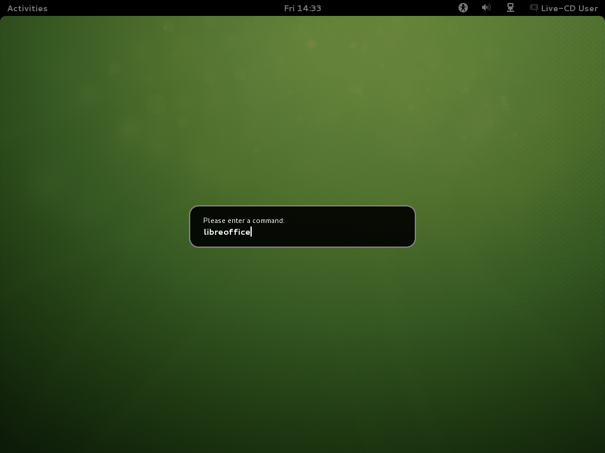

###5 Manage Files, Folders and Media

Use the Nautilus File Manager to create and view folders and documents, run scripts and create CDs of your data. To open Nautilus, change to the Activities view (with the Windows key for example) and click on the icon with the filing cabinet in Dash. In fallback mode, instead you open Places followed by Personal Folder. In any case, a new window appears with the content of your home directory.
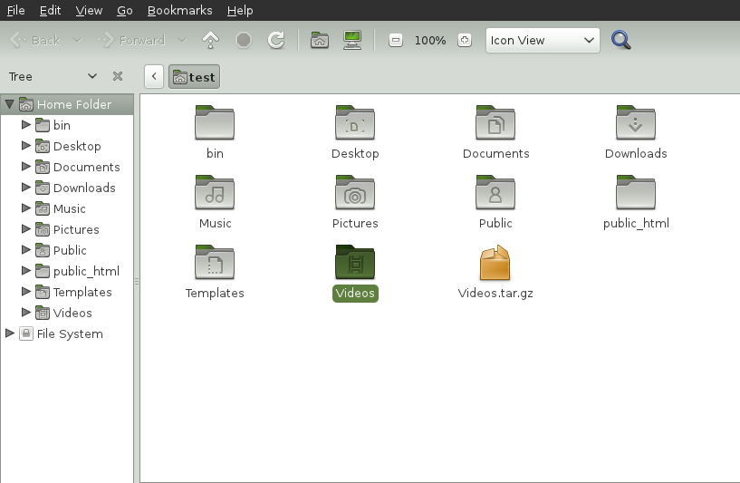

The elements of the Nautilus window include the following:

Menu.  Lets you perform most tasks.

Path bar.  Lets you find files and folders.

Side bar.  Lets you navigate or display information about the selected file or folder.

View pane.  Displays folders and files. Use the options in the View menu to increase or decrease the content in the view pane and to display items as a list or as icons.

####5.1 Handling Media

What happens exactly if you insert a CD or a DVD into the drive or connect a device (such as a flash drive or a removable disk) depends on the content of the medium. In the simplest case, the file manager opens to display the content of the media.

However, in some cases you can also take a different action. To do that, use the message with a corresponding selection on the bottom edge of the screen. When you insert a DVD, you can for instance decide whether you would like to open it with the media player or the file manager. When in fallback mode, GNOME asks in a new window how to open the data carrier. You can then select a matching application in a drop-down list, Open Folder shows the content of the data carrier in a new Nautilus window. Should GNOME not open a window, you can of course start Nautilus manually.

The Nautilus window lists all connected or inserted data carriers in the side pane in the Devices area. By clicking on the arrow icon on the right adjacent to its name you can eject the CD or the DVD or the connected flash drive.

####5.2 Creating a CD or DVD

If your system has a CD or DVD burner, use the Nautilus file manager to burn CDs and DVDs.

1.	Insert an empty data medium and open it in the CD/DVD creator. GNOME then opens a new Nautilus window.

2.	Copy the desired files and folders for the CD or DVD into this window.
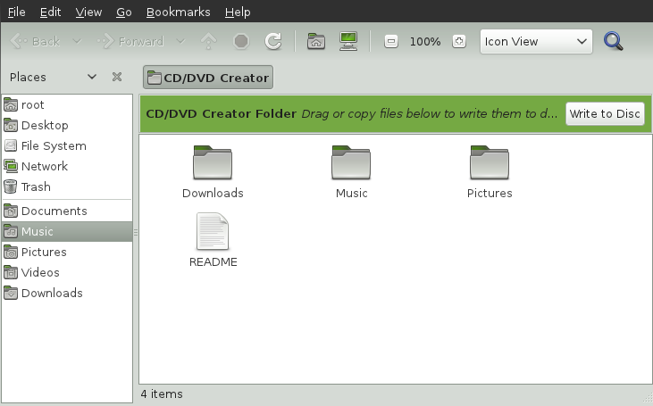
3.	To write data to the CD or DVD, click on Write to CD/DVD.

4.	Change the corresponding data in the CD/DVD Creator window or accept the standard settings. Then click on Burn. Now there is no turning back: GNOME will write the files onto the disk. This could take a few minutes, depending on the amount of data being copied and the speed of your burner.

To burn data and audio CDs, you can also use the more extensive burning program Banshee Brasero.

####5.3 Creating and Unpacking Archives

If you have files you have not used recently but want to keep on your computer, you can compile and compress them in an archive file.

1.	To do so, right-click on the folder to be archived in Nautilus and then select Compress.
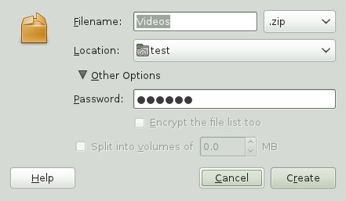

2.	Accept the default archive file name or provide a new name.

3.	Select a file name extension from the drop-down list beside to the right. At the same time, you also determine the compression method. Use .zip if you would like to forward the archive to other people or protect it with a password. In Linux the .tar.gz format is also widely used.

4.	Enter a location for the archive file.

5.	If you have decided to use a .zip file, you can still click on the plus sign and open Other Options and enter a password there. Remember this password well. If you forget it, you will be unable to access the content of the archive.

6.	Then click on Create.

To unpack an archive created in this way, right-click on the file and select Extract here.

####5.4 Using Bookmarks

Use bookmarking feature of Nautilus to highlight your favorite folders. A matching entry then appears for quick access in the side pane.

1.	Switch (with a double-click) to the folder for which a bookmark should be created.

2.	Click on Bookmark › Add bookmark. The bookmark is added to the list. The folder name is used as the bookmark name.

3.	To select an item from the bookmarks list, click on Bookmark then click on the desired bookmark in the list.

You can also organize your bookmarks list by clicking on Bookmark › Edit bookmarks and making your selection in the dialog box.

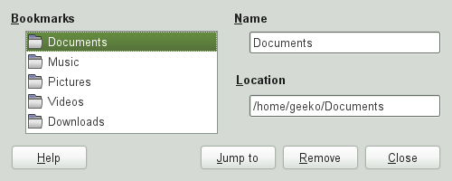

To change the order of your bookmarks, click a bookmark shown in the Edit bookmarks dialog box and drag it to the desired location.

###6 Customizing your Work Environment

You can find more precise settings to adjust the overall appearance and behavior of your desktop in System Settings. There you can also change keyboard and mouse configurations, regional and language settings, parameters for your Internet and network usage, and more.

To open System Settings, click on your name in the (top) panel and then on System Settings.

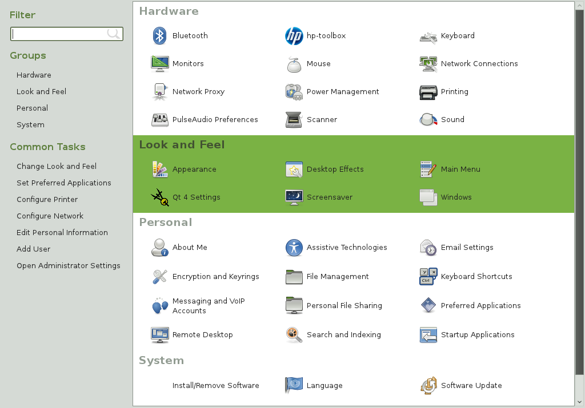

####6.1 Changing the Desktop Background

1.	Then click on Background.

 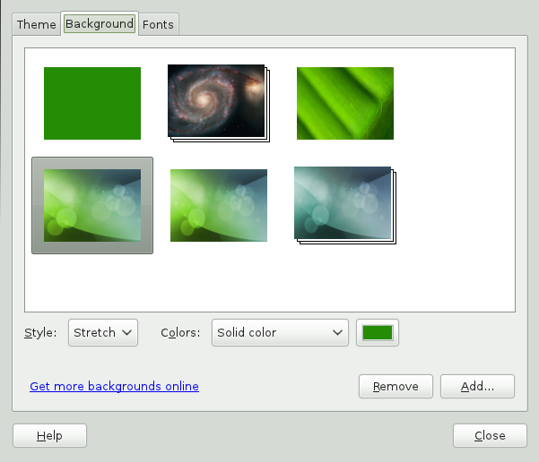

2.	If you would like to select a background image from pre-installed images, click on it from the list on the left pane.

3.	To add your own image, click on the plus sign on the bottom left pane corner, search for the desired image and let it open.

4.	To display a colored background, select from the Background images drop-down list the item Colors and Color Gradients, highlight the single-color rectangle in the list, click on the bottom right of the window on the button with the color and then choose the desired color.

5.	You can return to all system settings via the button with the nine small rectangles on it in the very top left hand corner of the window.

###7 Browsing the Internet with Firefox

Firefox* is one of the most popular Web browsers. It works like all other browsers, but offers additional functions such as tools for security and data protection.

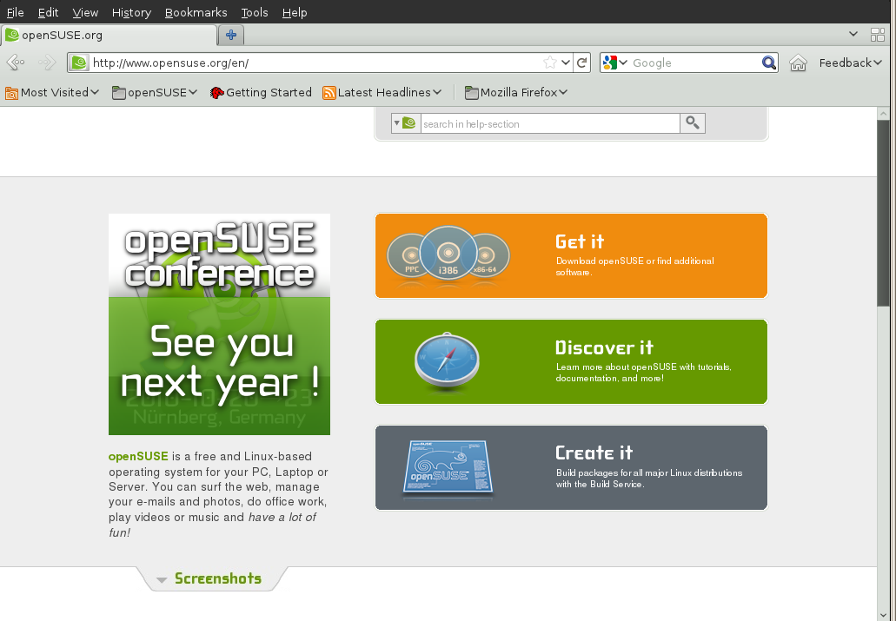

To start Firefox, switch to the activities view (such as via the Windows key) and click on the icon with the globe and the fox in Dash. In fallback mode, you instead open Applications › Internet › Firefox.

Firefox awaits with all modern web technologies, such as use of tabs, pop-up blockers and download and image management. Its easy access to different search engines helps you find the information you need. Enter an Internet address (URL) in the address bar to start browsing.

To open a new empty tab in Firefox click on Ctrl–T or on the “+” beside to the last tab. Type a new Internet address to browse. To open the page behind a link in a new tab, click on the link with the middle mouse button. Right-clicking on the tab displays a small menu. You can create a new tab, reload the content of a specific tab or all existing tabs, or close a single tab or all tabs. You can also change the order of the tabs by dragging & dropping them to a new position.

####7.1 Finding Information

1.	To start a Web search type the keywords in the integrated search box on the right of the address bar, then press Enter. Firefox will display the results in the active tab.

2.	If you would like to use a specific search engine, click on the icon with the small down arrow on the search bar.

3.	Click on the desired engine, then press Enter to start the search.

To search for words in the current website, press Ctrl–F. Enter your keywords in the search bar now shown on the bottom of the window. Use the buttons to the right of the search box to switch the search direction or to highlight all results in the text.

####7.2 Downloading Files from the Web

If you download a file with Firefox, the Firefox download manager starts automatically. It then saves the file in the folder previously set in the Firefox Preferences. By default, it uses the Downloads folder in your home directory. Firefox shows the finished downloads in the Downloads window.

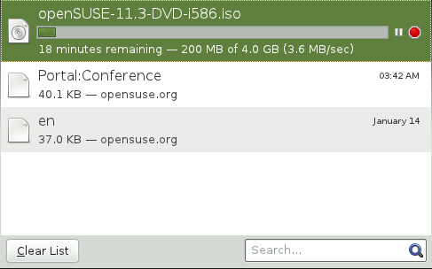

Open the downloaded files directly from the Downloads window or from the destination folder. Click on Clean List to clean up the history of downloaded files.

####7.3 Configuring Preferences

If you change the standard folder for downloaded files, or activate or want to change the pop-up blocker, click on Edit › Preferences.

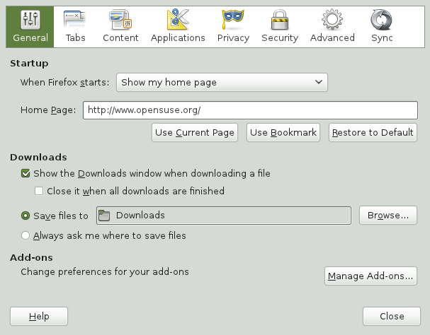

You can configure advanced settings here, such as the appearance, the language, data protection and the tab options. Click on the icons and set the options on each page according to your preferences. To apply the changes click on Close.

###8 Managing Passwords

GNOME allows you to store your passwords and encryption keys in a Keying. This is especially useful if you want to store passwords for different websites.

To create a new key ring, proceed as follows:

1.	Press Alt–F2 and enter seahorse.

2.	Select File › New.

3.	Select Password Key Ring and continue with More.

4.	Enter a name for the key ring and click on Add. A new window appears.

5.	Enter your password, confirm the password, and click Continue.

You can create as many key rings as you like. For example, you can create one for private use and a second one for business. To store passwords in your key ring, proceed as follows:

1.	Press Alt–F2 and enter seahorse.

2.	Select File › New.

3.	Select Save password and continue with More.

4.	Select the key ring, enter a description and the password.

5.	Finally click on Add.

###9 E-mail and Calendar

To read and manage your mails, contacts, appointments, and tasks, openSUSEcontains the program Evolution™, which allows you to conveniently save, organize, and call up your personal information.

With its extensive support for communications and data interchange standards, Evolution can work with existing corporate networks and applications, including Exchange*.

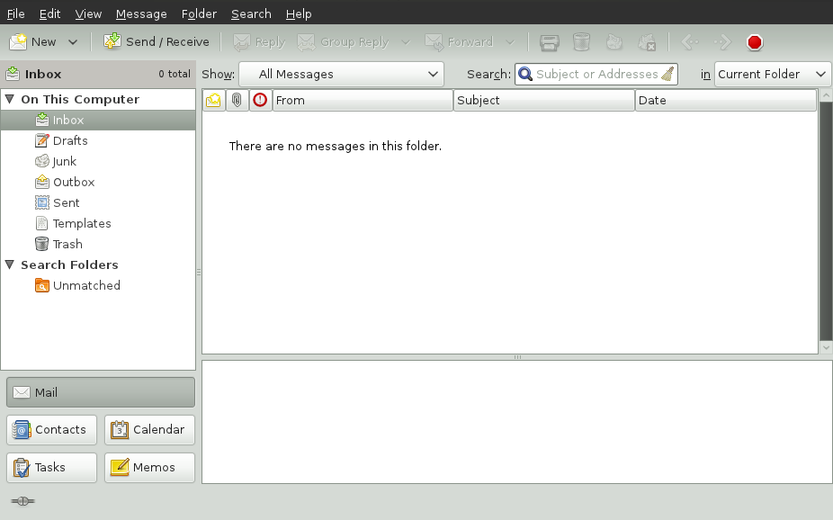

To start Evolution, switch to the activities view (for example, via the Windows key) and click on the letter icon. In fallback mode, select Applications › Internet › Evolution E-Mail and Calendar.

If you are starting Evolution for the first time, you will be asked to answer a series of questions. The queried information is needed to set up your e-mail account and helps you import e-mail messages from your old e-mail client. It shows you how many new messages you have and lists upcoming appointments and tasks, as well as the current weather and news from news feeds. The calendar, address book and e-mail tools are available on the toolbar on the left side of the program window.

Press `Ctrl`–`N` to open a new item in the area of Evolution where you are working. This creates a new message in e-mail. In the address book `Ctrl`–`N` creates a new contact card and a new appointment in the calendar.

If you would like additional information, click in any window on Help › Content.

###10 Instant Messaging with Empathy

Empathy is a multi-protocol Instant Messaging (IM) client. It is compatible with AOL Instant Messenger (AIM), Google Talk, GroupWise® Messenger, ICQ, IRC, MSN Messenger, Jabber/XMPP, Yahoo!* and other networks.

With Empathy, you can log in to multiple accounts on multiple IM networks simultaneously. Empathy also supports many features of various networks such as video chat, file transfer, away messages and typing notification.

To start Empathy, switch to the activities view (for example, via the Windows key) and click on the icon with the speech balloon and the blue smiley in the Dash. In fallback mode, try Applications › Internet › Empathy Instant Messenger Service.

To add an account to Empathy, use the configuration assistant, then select Edit › Accounts. Click on the plus symbol, select the desired protocol and enter your registration information into the relevant fields. Click on Apply and Close, in order to activate your IM account.
Add contacts by clicking on Chat › Add Contacts. Select the account, the Identifier (ID), and the alias information that is relevant to the new content, and confirm with Add. However, you must be online and connected to the selected messaging service to add a contact to your list.

To start a chat, double-click on the desired contact and type your message in the lower part of the chat window. Press Enter to send the message. The upper part of the window displays the messages you have sent and received.

###11 Starting LibreOffice

LibreOffice offers comprehensive and powerful office programs, including a text processing program, a table calculation application, a program for the creation of presentations, a vector graphic program and a database application. Because LibreOffice is available for a number of operating systems, you can use the documents across different operating systems.

To start LibreOffice switch to the activities view (for example, by pressing the Windows key) and then click on the blue document. Alternatively, type writer in the search box and press Enter. In fallback mode, click on Applications › Office › LibreOffice Writer. If you would like to create a new document, click on File › New and select the document type. To open an existing document, select Open, then select the file you want from the file system.

###12 Viewing PDF Files and Other Documents

Documents that need to be shared or printed across platforms are often saves as PDF (Portable Document Format) files. PDF files can be created using the LibreOffice suite or other applications. The PDF viewer of GNOME is called Evince. It can be used to view PDFs and many other document formats like PostScript, DjVu, DVI, and multi-page TIFFs.

To start Evince, press Alt–F2 and enter evince.

1.	To view a PDF file, double-click on the file you want.

 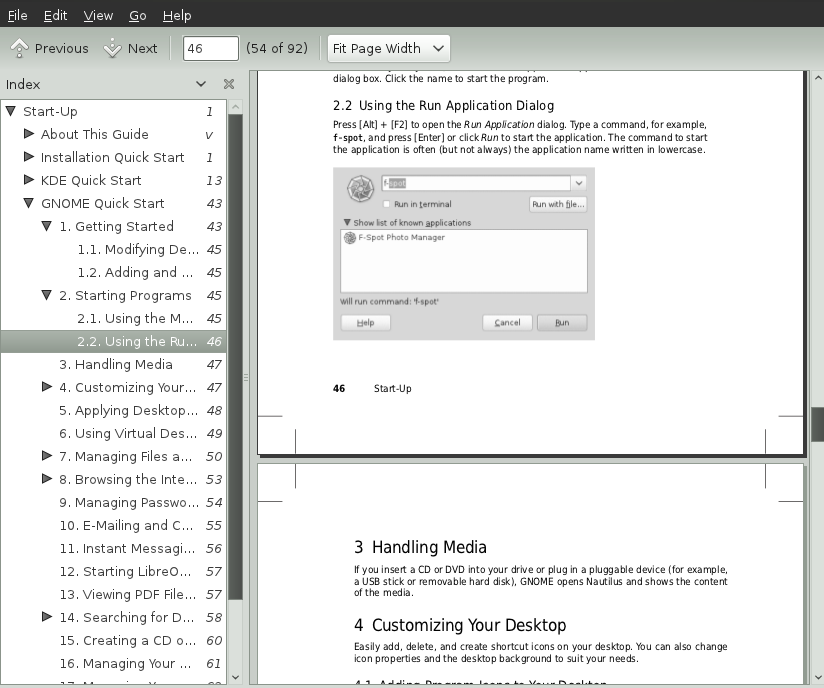

2.  Use the navigation icons at the top of the window to navigate through the document. If the PDF document contains bookmarks, you can access them to the left of the side pane.

###13 Managing Your Digital Image Collection

Shotwell is a management tool for digital image collections. You can assign various category tags to your images. It also offers many practical image editing options. For example, you can remove red eye, crop an image to size as well as adjust brightness and colors. Shotwell supports all important file formats, such as JPEG, PNG, TIFF and various manufacturer-specific RAW formats, for example. With Shotwell, you can also export photos to your Flickr, Picasa or Facebook account.

To access Shotwell, open the activities view (for example, by pressing the Windows key) and then click on the icon with the images in Dash. In fallback mode, you can find Shotwell via Applications › Graphics › Shotwell Photo Manager. After you pass through the welcome window by clicking OK, Shotwell immediately runs through your image folder and automatically add all the images stored in it to its library.

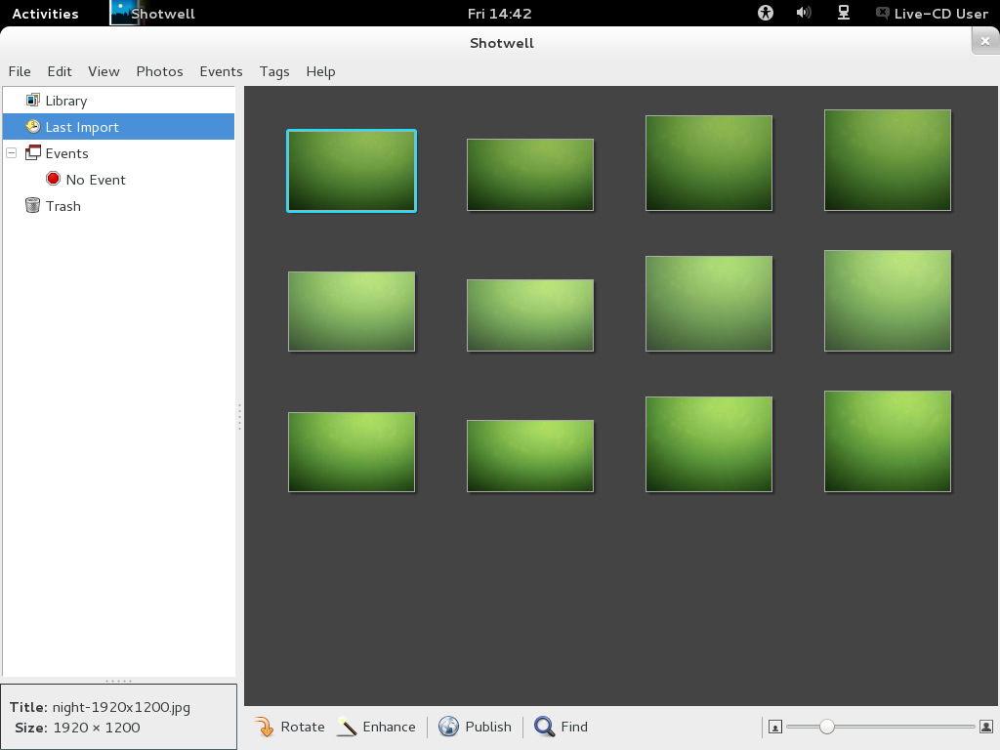

Shotwell shows thumbnails of the images to the right in the window. As soon as you click one of them, you can rotate it, re-edit it (enhance it) or publish it in an Internet service with the buttons on the lower edge. The side bar to the left offers different views of your photo portfolio.
Provided the photos were stamped with a date, you can limit the display to photos from a specific year via Events for example.

You import new photos via File › Import from Folder. Shotwell always copies them to your image folder. If you would like to set another folder for this, go to Edit › Preferences and choose the corresponding folder under Import Photos to.

###14 Managing Your Music and Videos

Use Banshee to import CDs, synchronize your media collection to a digital media player, play music directly from a digital media player, create playlists with songs or videos from your library, create audio and data CDs from subsets of your library, and subscribe to, download, and listen to your favorite podcasts. Banshee also has an Internet
Radio plug-in that allows you to listen to audio streams.

To open Banshee switch to activities view (for example, via the Windows key) and click on the icon with the b in the form of a note. In fallback mode click on Applications › Multimedia › Banshee Media Player.

When you start the Banshee for the first time, you need to import your media to make them available in the library. From the menu, call up Media › Import Media. Select an import source and click on Choose Files or Choose Folders. After successfully importing your media, you can access them from your library.

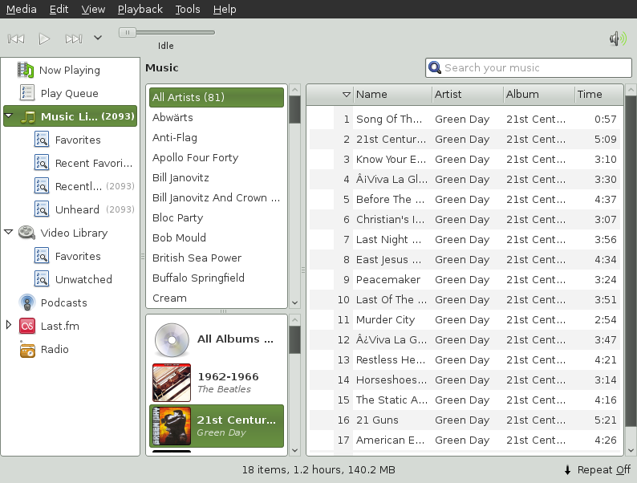

To play a song or a movie, simply select it in the library and click the play button. You can also use the buttons in the upper left corner to pause a song or play the next or previous song. Use the loudspeaker button on the right to adjust the volume.

Banshee has an integrated CD player. When you insert a music CD, your CD title appears in the left panel. Select the title and click on the Play button to play your full CD.

To create Audio and MP3 CDs, select the desired song and then click on Edit › Write CD in the menu .

###15 Ending Your Session

Once you have finished your work on the computer, you can log out. However, you can also restart the system or shut down the computer.

####15.1 Logging Out or Switching Users

Click on your user name on the top right in the panel and then select one of the following options:

**Log Out..**.  Logs you out of the current session and returns you to the login screen.

**Switch User**.  Likewise returns you to the login screen but, in contrast to Log Out, the applications started continue running in the background. This feature is subsequently offered if another person has to log in to your computer for a short while using his or her own user account.

**Lock Screen**.  Turns the screen black. You must enter your password to close it. This prevents unauthorized persons from working on or playing around with your computer during your absence.

####15.2 Restarting or Shutting Down the Computer

If openSUSE® can use the power-saving functions of your computer, your PC can switch to sleep mode via the Suspend item. Otherwise, GNOME offers you Power Off.... Power Off... can also be accessed by holding down the Alt button while the menu is open. If click on it, a new window offers you the following actions:

**Power Off**.  Logs you out of the current session, then turns off the computer.

**Restart**.  Logs you out of the current session, then restarts the computer.

**Hibernate**.  This feature puts your computer into power-saving mode. The PC consumes only a small amount of electricity while in this mode. After you switch the PC on again, your work environment as you had left it becomes available again. In particular, all documents remain open.

###16 For More Information

Additional information on GNOME and GNOME applications can be found under [Official GNOME Page](http://www.gnome.org/).
