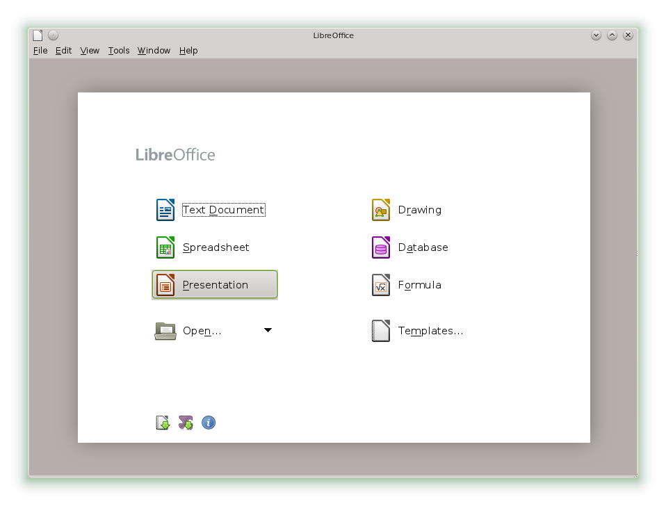
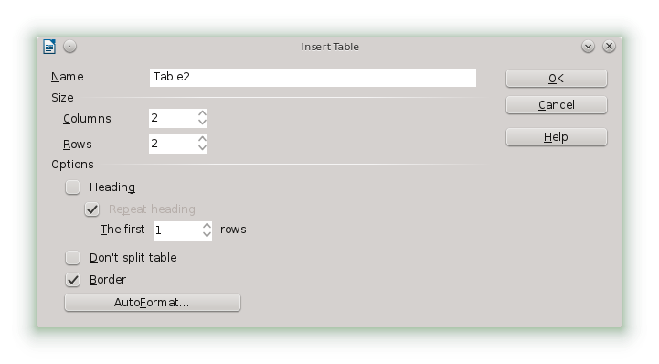
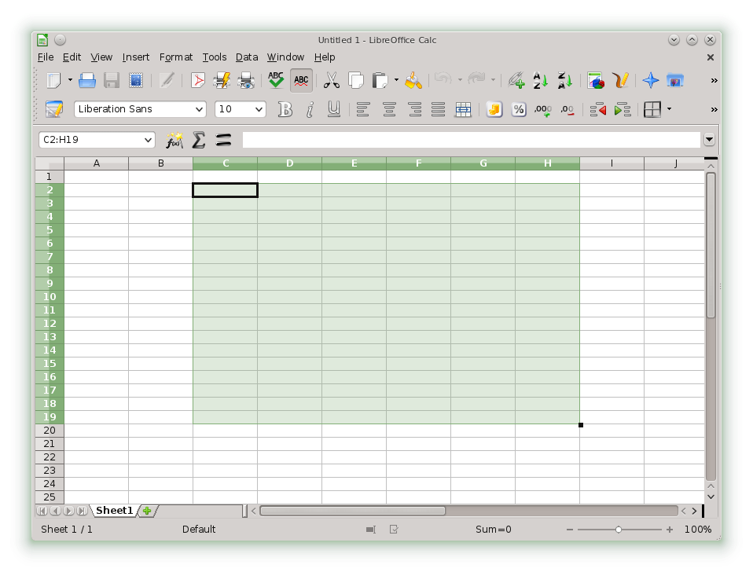
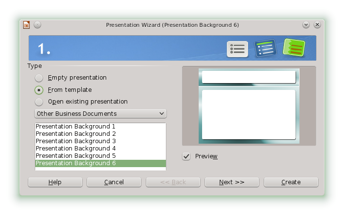
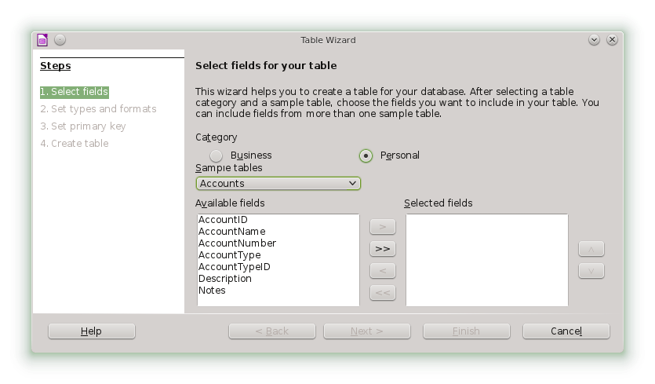

## LibreOffice Quick Start

LibreOffice is a powerful Office suite, consisting of word processing, spreadsheet, presentation, database and drawing programs.

###1 Compatibility
LibreOffice can work with documents, spreadsheets, presentations, and databases in many other formats, including Microsoft Office™. They can be seamlessly opened like other files and saved back to the original format. Though some work has already been invested in interoperability, occasionally there are still formatting issues. If you have problems with your documents, consider opening them in the original application and resaving them in an open format such as RTF for text documents. In case of migration problems with spreadsheets however, it is advisable to resave them as Excel files and use this as intermediate format (with CSV format you would lose all cell formatting and CSV sometimes leads to incorrect cell type detection for spreadsheets).

###2 LibreOffice Modules

LibreOffice consists of several application modules (subprograms), which are designed to interact with each other. All modules feature the same graphical user interface and similar functionality.

**Table 4.1: The LibreOffice Modules **

|Module              | 	Usage                     |
|:-------------------|:---------------------------|
|Writer 	         |Text document module        |
|Calc 	             |Spreadsheet module          |
|Impress 	         |Presentation module         |
|Base 	             |Database module             |
|Draw 	             |Vector graphics module      |
|Math 	             |Mathematical equation module|
###3 Starting LibreOffice

To start the LibreOffice suite, press `Alt`–`F2`, type **libreoffice** and press `Enter`. In the appearing window, select the module you want to open. If an LibreOffice application is open, you can start any of the other applications by clicking *File › New › Name of Application*.

####3.1 Saving LibreOffice Files

1.	To save a file, select *File › Save* or *Save as* from the *Menu Bar* or use the shortcut `Ctrl`–`Shift`–`S`.
2.	Select the directory where you want to save the file.

3.	Enter the filename in the *Name* box.

4.	From the *File Type* box, select the format in which you want to save the file.
In all modules you can save your documents as native LibreOffice files, LibreOffice templates, Microsoft files and StarOffice files.

####3.2 Navigator and Navigation Shortcuts

The *Navigator* tool displays information about the contents of a document. It also lets you quickly jump to different elements. For example, you can use the Navigator to get a quick overview of all images included in the document. To open the *Navigator*, click *View › Navigator* or with `F5`. The elements listed in the Navigator vary according to the LibreOffice module being used.

You can also navigate your files with the following shortcuts:

**Table 4.2: Navigation Shortcuts **

|Action 	                         |Shortcut         |
|:-----------------------------------|:---------------:|
|Delete to the End of the Word 	     |`Ctrl`–`Del`     |
|Delete to the Beginning of the Word |`Ctrl`–`<—`      |
|End of Document 	                 |`Ctrl`–`End`     |
|End of Line 	                     |`End`            |
|Select All 	                     |`Ctrl`–`A`       |
|Start of Line 	                     |`Home`           |
|Top of Document 	                 |`Ctrl`–`Home`    |
|Word Left 	                         |`Ctrl`–`← `      |
|Word Right 	                     |`Ctrl`–`→ `      |

####3.3 Using and Creating Templates

LibreOffice comes with a set of predefined templates, and you can find additional templates on the Internet. If you want to create your own templates, you need to determine what you want the document to look like and create the styles you need in that template.

For text document, spreadsheets, presentations, and drawings, you can easily create a template from an existing document as follows:

1.	Start LibreOffice and open or create a document that contains the styles that you want to use as a template.

2.	Click *File › Templates › Save*.

3.	Specify a name for the template.

4.	In the *Categories* box, click the category where you want to place the template.

5.	Click* OK*.

###4 LibreOffice Writer

LibreOffice Writer is a full-featured word processor with page and text-formatting capabilities. It also includes some features that are usually found only in expensive desktop publishing applications. Many of the LibreOffice Writer features apply also to other LibreOffice modules.

####4.1 Creating a New Document
LibreOffice Writer allows you to create a new document in one of the following ways:
* From Scratch.  To create a document from scratch, click *File › New › Text Document* and a new empty Writer document is created.
* Wizard.  To use a standard format and predefined elements for your own documents use a wizard. Click *File › Wizards* and the wizard you wish to use. Then follow the steps.
* Templates.  To use a template, click *File › New › Templates and Documents* and choose one of the many folders (for example, Business Correspondence). Then choose a Template and click on *Open*. Now a new document based on the style of your selected template is created.

To use a standard format and predefined elements for your own documents, try a wizard (a small utility that lets you make some basic initial decisions and then produces a ready-made document from a template). For example, to create a business letter, click *File › Wizards › Letter*. With the wizard's dialogs, you can create a basic document that uses a standard format.

Enter text in the document window as desired. Use the *Formatting* toolbar or the *Format* menu to adjust the appearance of the document. Use the *File menu* or the relevant buttons in the toolbar to print and save your document. With the options under *Insert*, add extra items to your document, such as a table, picture, or chart.

####4.2 Customizing LibreOffice

With LibreOffice you can customize the default settings with the *Format menu*.

Below is a list of the most popular options available in most modules:

**Customizing Character Settings**

To set all character elements at the same time, select *Format › Character*.

**Customizing Paragraph Settings**

To format paragraphs, select *Format › Paragraph* and select the appropriate tabs for making changes.

**Customizing Alignment**

To modify the alignment, select *Format › Paragraph *and choose the alignment you want.

**Inserting Headers and Footers**

If you want to add headers and footers, click *Insert* and select either *Header* or *Footer*.

**Inserting Special Characters**

If you want to insert special characters, select *Insert › Special Character*.

**Inserting Footnotes**

If you want to insert footnotes, click *Insert* and select *Footnote*.

**Inserting Columns**

If you want to insert *columns*, click *Insert* and select *Section*. Then in the *Columns* tab, specify the number of columns to use for the current section.

**Inserting Indexes and Table of Contents**

If you want to insert indexes or a table of contents, click *Insert* and select *Indexes* and Tables.
The *Object Toolbar* offers additional text formatting options.

**Inserting Comments**

If you want to comment your text for others or for yourself, click *Insert › Comment*.

####4.3 Using Master Documents

If you are working with a very large document (such as a book), you might find it easier to manage the book with a master document, rather than keeping the book in a single file. A master document enables you to quickly apply formatting changes to a large document or to jump to each subdocument for editing.

A master document is a Writer document that serves as a container for multiple Writer files. You can maintain chapters or other subdocuments as individual files collected in the master document. Master documents are also useful if multiple people are working on a document. You can separate each person’s relevant part of the document into subdocuments, allowing multiple writers to work on their subdocuments at the same time without the danger of overwriting each other’s work.

1.	Click *File › New › Master Document*.
or
Open an existing document and click *File › Send › Create Master Document*.

2.	Insert subdocuments.

3.	Click *File Save*.

The LibreOffice help files contain more complete information about working with master documents. Look for the topic entitled *Working with Master Documents and Subdocuments*.

####4.4 Using Writer as HTML Editor

In addition to being a full-featured word processor, Writer also functions as an HTML editor. Writer includes HTML tags that can be applied the same way as any other style in a Writer document. You can view the document as it will appear online, or you can directly edit the HTML code.

1.	Click *File › New › HTML Document*.

2.	Press `F11` to open the *Styles* and *Formatting* window.

3.	Click the arrow at the bottom of the *Styles* and *Formatting window*.

4.	Select *HTML Styles*.

5.	Create your HTML document, using the styles to tag your text.

6.	Click *File › Save As*.

7.	Select the location where you want to save your file, name the file, and select HTML Document (.html) from the *File Type list*.

8.	Click *Save*.

If you prefer to edit HTML code directly, or if you want to see the HTML code created when you edited the HTML file as a Writer document, click *View › HTML Source*. In HTML Source mode, the Formatting and Styles list is not available. The first time you switch to HTML Source mode, you are prompted to save the file as HTML, if you have not already done so.

####4.5 Tables
You can include tabular data in the Writer, Impress and Draw module. Insert basic tables directly into your document either with the following menus items or by using the toolbar:
*   Insert › Table,
*	Table › Insert › Table,
*	or use the Table icon.

To enter data, select a cell with your mouse pointer and begin typing. To move around cells, use the arrow keys. `→|` moves to the next cell, skipping over the contents of the cell and `Shift`–`→|` moves backwards.

You can use *Table* menu or the *Table* toolbar to modify the table.

###5 LibreOffice Calc

Calc is the LibreOffice spreadsheet and data-plotting module. Spreadsheets consist of a number of sheets, containing cells which can be filled with elements like text, numbers, or formulas. A formula can manipulate data from other cells to generate a value for the cell into which it is inserted. Calc also allows you to define ranges, filter and sort the data, or create charts from the data to present it graphically. By using DataPilots, you can combine, analyze or compare larger amounts of data.

As with the entire LibreOffice suite, Calc can be used across a variety of platforms. It provides a number of exchange formats (including export to PDF documents), and can also read and save files in Microsoft Excel's format.

####5.1 Creating a New Document

Start LibreOffice and select *File › New › Spreadsheet* to create a new spreadsheet. Access the individual sheets by clicking the respective tabs at the bottom of the window.

Enter data in the cells as desired. To adjust appearance, either use the Formatting toolbar or the *Format menu*—or define styles. Use the *File menu* or the relevant buttons in the toolbar to print and save your document.

####5.2 Customizing LibreOffice Calc
Calc comes with a few built-in cell and page styles to improve the appearance of your spreadsheets and reports. Although these built-in styles are adequate for many uses, you will probably find it useful to create styles for your own frequently-used formatting preferences.

**Procedure 4.1: Creating a Style **

1.	Click *Format › Styles and Formatting*.

2.	In the *Styles and Formatting* window, click one of the icons representing either *Paragraph Styles*, *Character Styles*, or *Page Styles* icon.

3.	Right-click in the *Styles and Formatting* window, then click *New*.

4.	Specify a name for your style and use the various tabs to set the desired formatting options.

5.	Click *OK*.

**Procedure 4.2: Modifying a Style**

1.	Click *Format › Styles and Formatting*.

2.	In the *Styles and Formatting* window, click either the *Cell Styles* or the *Page Styles* icon.

3.	Right-click the name of the style you want to change, then click *Modify*.

4.	Change the desired formatting options.

5.	Click *OK*.

###6 Other LibreOffice Modules

Besides LibreOffice Writer and LibreOffice Calc, LibreOffice also includes the modules Impress, Base, Draw, and Math. With these you can create presentations, design databases, draw up graphics and diagrams and create mathematical formulas.

####6.1 Using Presentations with Impress
Use LibreOffice Impress to create presentations for screen display or printing, such as slide shows or transparencies. If you have used other presentation software, you can move comfortably to Impress, which works very similarly to other presentation software.

Impress can open and save Microsoft Powerpoint presentations, which means you can exchange presentations with Powerpoint users, as long as you save your presentations in Powerpoint format.

LibreOffice allows you to use transitions for your slides. Access the available transitions by selecting Slide Show › Slide Transitions.

You can either create a brand new presentation (without any preformatted slides) or use an existing template or presentation for your new document.

Impress uses styles and templates the same way other LibreOffice modules do. A wizard leads you through the options available for creating new presentations.

####6.2 Using Databases with Base

LibreOffice includes a database module (Base). Use Base to design a database to store many different kinds of information, from a simple address book or recipe file to a sophisticated document management system.

Tables, forms, queries, and reports can be created manually or using convenient wizards. For example, the Table Wizard contains a number of common fields for business and personal use. A wizard guides you through the steps to create a new database.

LibreOffice Base comes with several predefined database fields to help you create a database. A wizard guides you through the steps to create a new database. The following steps are specific to creating an address book using predefined fields, but it should be easy to use the predefined fields for any of the built-in database options. The process for creating a database can be broken into several subprocesses:

**Procedure 4.3: Creating a Database **

1.	Click* File › New › Database*.

2.	Select Create a new database and proceed with *Next*.

3.	Click *Yes, register the database for me* to make your database information available to other LibreOffice modules, select both check boxes in the bottom half of the dialog, then click *Finish*.

4.	Browse to the directory where you want to save the database, specify a name for the database, then click OK.

**Procedure 4.4: Setting Up the Database Table **

1.	In the *Table Wizard*, click *Personal*.

2.	The *Sample tables* list changes to show the predefined tables for personal use. If you had clicked *Business*, the list would contain predefined business tables.

In the Sample tables list, click *Addresses*. The available fields for the predefined address book appear in the *Available fields* menu.

3.	In the *Available fields* menu, click the fields you want to use in your address book.

You can select one item at a time, or you can shift-click multiple items to select them.

4.	Click the single arrow icon to move the selected items to the *Selected fields* menu.

To move all available fields to the *Selected fields* menu, click the double right- arrow.

5.	Use the arrow keys to adjust the order of the selected fields.

The fields appear in the table and forms in the order in which they are listed.

6.	Click on *Finish* to create a table for your address book, which you can now insert actual data into.

####6.3 Creating Graphics with Draw

Use LibreOffice Draw to create graphics and diagrams. You can save your drawings in today’s most common formats and import them into any application that lets you import graphics, including the other LibreOffice modules.

LibreOffice allows you to import Scalable Vector Graphics (*.svg) and WordPerfect Graphics (*.wpg).

Select File › Open and use the Filter drop-down list
to view which file formats can be opened.

**Procedure 4.5: Creating a Graphic **

1.	Click `Alt`–`F2` and enter ***oodraw*** to open LibreOffice Draw.

2.	Use the toolbar at the bottom of the window to create a graphic.

3.	Save the graphic.

To embed an existing Draw graphic into an LibreOffice document, select *Insert › Object › OLE Object*. Select *Create from file* and click *Search* to navigate to the Draw file to insert. If you insert a file as OLE object, you can easily edit the object later by double-clicking it.

**Procedure 4.6: Opening Draw From Other LibreOffice Modules**

One particularly useful feature of Draw is the ability to open it from other LibreOffice modules so you can create a drawing that is automatically imported into your document.

1.	From an LibreOffice module (for example, from Writer), click *Insert › Object › OLE Object › LibreOffice 3.6 Drawing › OK*. This opens Draw.

2.	Create your drawing.

3.	Click in your document, outside the Draw frame.
The drawing is automatically inserted into your document.

####6.4 Creating Mathematical Formulas with Math

It is usually difficult to include complex mathematical formulas in your documents. The LibreOffice Math equation editor lets you create formulas using operators, functions, and formatting assistants.
You can then save those formulas as objects that can be imported into other documents.
Math functions can be inserted into other LibreOffice documents like any other graphic object.

Using Math, you can enter your equation in three different ways:
* Type markup in the equation editor,
* Right-click on the equation editor and select the symbol from the context menu,
or
* Select a symbol from the *Selection toolbox*.

        **Note:**
        Math is not a calculator. The functions it creates are graphical objects. Even if they are imported into Calc, these functions cannot be evaluated.

###7 For More Information

LibreOffice also contains extensive online help. In addition, a large community of users and developers support it. For more details, see the following links:
[New Features](http://www.libreoffice.org/download/3-4-new-features-and-fixes/)
A list of all new features available with LibreOffice.
[Libreoffice Help](http://www.libreoffice.org/get-help/documentation/)
Official LibreOffice support page, provides manuals and other documentation.

