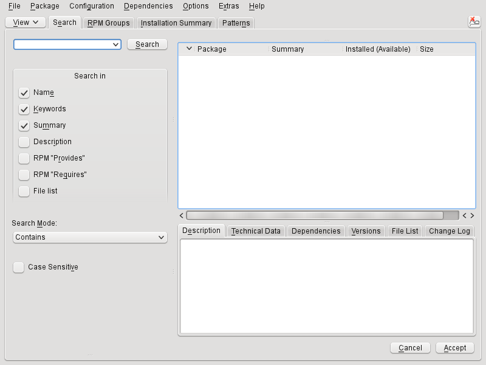
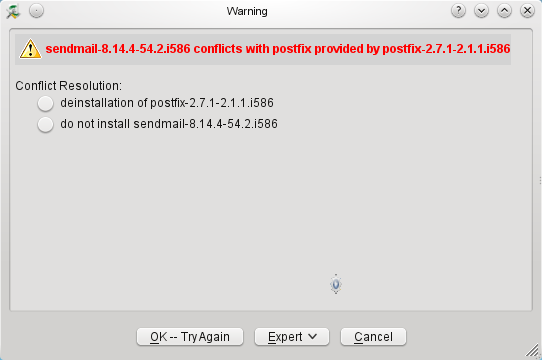
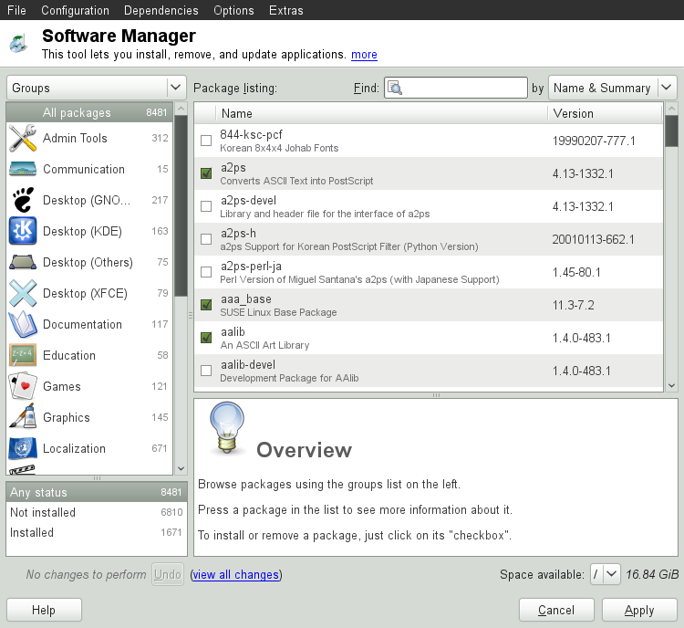
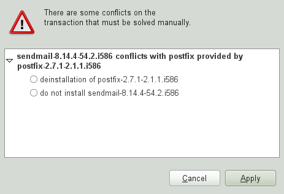
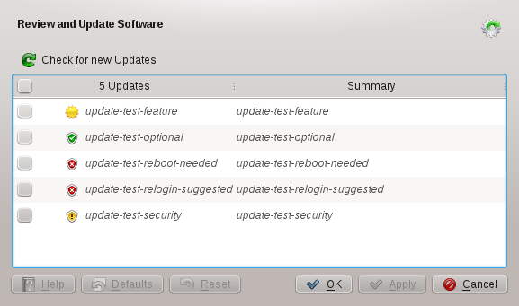
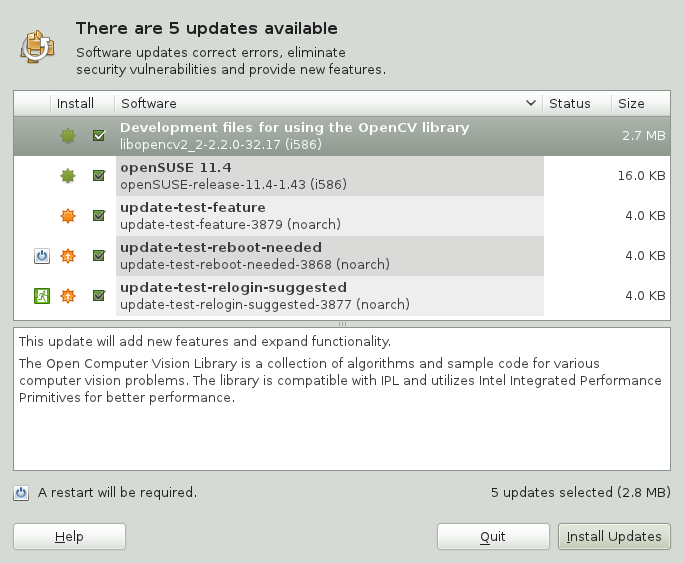

## Installing or Removing Software

Use YaST's software management tool to search for software components you want to add or remove. YaST resolves all dependencies for you. To install packages not shipped with the installation media, add additional software repositories to your setup and let YaST manage them. Keep your system up-to-date by managing software updates with the update applet.
Change the software collection of your system with YaST Software Manager. This YaST module is available in three toolkit flavors: Qt (for KDE desktops), GTK+ (for GNOME desktops), and ncurses (providing a pseudo-graphical user interface in text mode). This chapter describes Qt and GTK+ flavors—for details on the ncurses YaST, see Chapter 12, YaST in Text Mode.

>**Tip: Changing the Toolkit Flavor :**
>By default, YaST is started with the toolkit matching your desktop (GTK+ under GNOME, Qt under KDE). To alter this default setting system-wide, change the variable WANTED_GUI in /etc/sysconfig/yast2 to either qt or gtk.

If you do not want to change the system-wide settings, you can nevertheless start YaST in the desired flavor from command line by using the --gtk or --qt parameter, respectively. For example: **yast2 --gtk**.

>**Note: Confirmation and Review of Changes :**
When installing, updating or removing packages, any changes in the Software Manager are not applied immediately but only after confirming them with Accept or Apply respectively. YaST maintains a list with all actions, allowing you to review and modify your changes before applying them to the system.

###1 Definition of Terms

**Repository**

A local or remote directory containing packages, plus additional information about these packages (package meta-data).

**(Repository) Alias**

A short name for a repository used by various zypper commands. The alias can be chosen by the user when adding a repository and must be unique.

**Product**

Represents a whole product, for example openSUSE®.

**Pattern**

A pattern is an installable group of packages dedicated to a certain purpose. For example, the Laptop pattern contains all packages that are needed in a mobile computing environment. Patterns define package dependencies (such as required or recommended packages) and come with a preselection of packages marked for installation. This ensures that the most important packages needed for a certain purpose are available on your system after installation of the pattern. However, not necessarily all packages in a pattern are preselected for installation and you can manually select or deselect packages within a pattern according to your needs and wishes.

**Package**

A package is a compressed file in rpm format that contains the files for a particular program.

**Patch**

A patch consists of one or more packages and may be applied by means of deltarpms. It may also introduce dependencies to packages that are not installed yet.

**Resolvable**

An generic term for product, pattern, package or patch. The most commonly used type of resolvable is a package or a patch.

**Deltarpm**

A deltarpm consists only of the binary diff between two defined versions of a package, and therefore has the smallest download size. Before being installed, the full RPM package is rebuilt on the local machine.

**Package Dependencies**

Certain packages are dependent on other packages, such as shared libraries. In other terms, a package may require other packages—if the required packages are not available, the package cannot be installed. In addition to dependencies (package requirements) that must be fulfilled, some packages recommend other packages. These recommended packages are only installed if they are actually available, otherwise they are just ignored and the package recommending them is installed nevertheless.

###2 Using the KDE Interface (Qt)

The YaST Qt interface is started by default when using the desktops KDE, icewm, and others. It is also used when invoking YaST from a remote terminal. Start the software manager from the YaST Control Center by choosing *Software › Software Management*.

####2.1 Views for Searching Packages or Patterns

The YaST software manager can install packages or patterns from all currently enabled repositories. It offers different views and filters to make it easier to find the software you are searching for. The *Search* view is the default view of the window. To change view, click *View* and select one of the following entries from the drop-down list. The selected view opens in a new tab.

**Patterns**

Lists all patterns available for installation on your system.

**Package Groups**

Lists all packages sorted by groups such as *Graphics*, *Programming*, or *Security*.

**RPM Groups**

Lists all packages sorted by functionality with groups and subgroups. For example *Networking* › *Email* › *Clients*.

**Languages**

Filter to list all packages needed to add a new system language.

**Repositories**

Filter to list packages by repository. In order to select more than one repository, hold the `Ctrl` key while clicking on repository names. The “pseudo repository” *@System* lists all packages currently installed.

**Search**

Lets you search for a package according to certain criteria. `Enter` a search term and press Enter. Refine your search by specifying where to *Search In* and by changing the *Search Mode*. For example, if you do not know the package name but only the name of the application that you are searching for, try including the package *Description* in the search process.

**Installation Summary**

If you have already selected packages for installation, update or removal, this view shows the changes that will be applied to your system as soon as you click *Accept*. To filter for packages with a certain status in this view, activate or deactivate the respective check boxes. Hit `Shift`–`F1` for details on the status flags.

>**Tip: Finding Packages not Belonging to an Active Repository :**
To list all packages that do not belong to an active repository, choose *View › Repositories › @System* and then choose Secondary *Filter › Unmaintained* Packages. This is useful, for example, if you have deleted a repository and would like to make sure no packages from that repository remain installed.

####2.2 Installing and Removing Packages or Patterns

Certain packages are dependent on other packages, such as shared libraries. On the other hand, some packages cannot coexist with others on the system. If possible, YaST automatically resolves these dependencies or conflicts. If your choice results in a dependency conflict that cannot be automatically solved, you need to solve it manually as described in Section 5.2.4, “Checking Software Dependencies”.

>**Note: Removal of Packages :**
When removing any packages, by default YaST only removes the selected packages. If you want YaST to also remove any other packages that become unneeded after removal of the specified package, select Options › Cleanup when deleting packages.

1.	Search for packages as described in Section 5.2.1, “Views for Searching Packages or Patterns”.

2.	The packages found are listed in the right pane. To install a package or remove it, right-click it and choose Install or Delete. If the relevant option is not available, check the package status indicated by the symbol in front of the package name—hit `Shift`–`F1` for `help`.

    >**Tip: Applying an Action to All Packages Listed :**
To apply an action to all packages listed in the right pane, choose an action from Package › All in This List.

3.	To install a pattern, right-click the pattern name and choose *Install*.

4.	It is not possible to remove a pattern per se. Instead, select the packages of a pattern you want to remove and mark them for removal.

5.	In order to select more packages, repeat the steps mentioned above.

6.	Before applying your changes, you can review or modify them by clicking *View › Installation* Summary. By default, all packages that will change status, are listed.

7.	In order to revert the status for a package, right-click the package and select one of the following entries: *Keep* if the package was scheduled to be deleted or updated, or *Do Not Install* if it was scheduled for installation. To abandon all changes and close the Software Manager, click *Cancel* and *Abandon*.

8.	When you are finished, click* Accept* to apply your changes.

9.	In case YaST found dependencies on other packages, a list of packages that have additionally been chosen for installation, update or removal is presented. Click *Continue* to accept them.

After all selected packages are installed, updated or removed, the YaST Software Manager automatically terminates.

>**Note: Installing Source Packages :**
Installing source packages with YaST Software Manager is not possible at the moment. Use the command line tool zypper for this purpose.

####2.3 Updating Packages

Instead of updating individual packages, you can also update all installed packages or all packages from a certain repository. When mass updating packages, the following aspects are generally considered:
*	priorities of the repositories that provide the package,
*	architecture of the package (for example, x86_64, i686, i586),
*	version number of the package,
*	package vendor.

Which of the aspects has the highest importance for choosing the update candidates depends on the respective update option you choose.
1.	To update all installed packages to the latest version, choose *Package › All Packages › Update if Newer Version Available* from the main menu.

    All repositories are checked for possible update candidates, using the following policy: YaST first tries to restrict the search to packages with the same architecture and vendor like the installed one. If the search is positive, the “best” update candidate from those is selected according to the process below. However, if no comparable package of the same vendor can be found, the search is expanded to all packages with the same architecture. If still no comparable package can be found, all packages are considered and the “best” update candidate is selected according to the following criteria:

1.	Repository priority: Prefer the package from the repository with the highest priority.

2.	If more than one package results from this selection, choose the one with the “best” architecture (best choice: matching the architecture of the installed one; otherwise: x86_64 > i686 > i586).
If the resulting package has a higher version number than the installed one, the installed package will be updated and replaced with the selected update candidate.

    This option tries to avoid changes in architecture and vendor for the installed packages, but under certain circumstances, they are tolerated.

>**Note: Update Unconditionally :**
If you choose Package › All Packages › Update Unconditionally instead, basically the same criteria apply but any candidate package found is installed unconditionally. Thus, choosing this option might actually lead to downgrading some packages.

2.	To make sure that the packages for a mass update derive from a certain repository:
*	Choose the repository from which to update as described in Section *2.1, “Views for Searching Packages or Patterns”* .
*	On the right hand side of the window, click *Switch* system packages to the versions in this repository. This explicitly allows YaST to change the package vendor when replacing the packages.
As soon as you proceed with *Accept*, all installed packages will be replaced by packages deriving from this repository, if available. This may lead to changes in vendor and architecture and even to downgrading some packages.
*	To refrain from this, click *Cancel* switching system packages to the versions in this repository. Note that you can only cancel this until you press the *Accept* button.
	Before applying your changes, you can review or modify them by clicking *View › Installation Summary*. By default, all packages that will change status, are listed.
	If all options are set according to your wishes, confirm your changes with Accept to start the mass update.

####2.4 Checking Software Dependencies

Most packages are dependent on other packages. If a package, for example, uses a shared library, it is dependent on the package providing this library. On the other hand some packages cannot coexist with each other, causing a conflict (for example, you can only install one mail transfer agent: sendmail or postfix). When installing or removing software, the *Software Manager* makes sure no dependencies or conflicts remain unsolved to ensure system integrity.

In case there exists only one solution to resolve a dependency or a conflict, it is resolved automatically. Multiple solutions always cause a conflict which needs to be resolved manually. If solving a conflict involves a vendor or architecture change, it also needs to be solved manually. When clicking Accept to apply any changes in the Software Manager, you get an overview of all actions triggered by the automatic resolver which you need to confirm.

By default, dependencies are automatically checked. A check is performed every time you change a package status (for example, by marking a package for installation or removal). This is generally useful, but can become exhausting when manually resolving a dependency conflict. To disable this function, uncheck *Dependencies › Autocheck. Manually* perform a dependency check with *Dependencies › Check Now*. A consistency check is always performed when you confirm your selection with Accept.

To review a package's dependencies, right-click it and choose *Show Solver Information*. A map showing the dependencies opens. Packages that are already installed are displayed in a green frame.

>**Note: Manually Solving Package Conflicts :**
Unless you are very experienced, follow the suggestions YaST makes when handling package conflicts, otherwise you may not be able to resolve them. Keep in mind that every change you make, potentially triggers other conflicts, so you can easily end up with a steadily increasing number of conflicts. In case this happens, Cancel the *Software Manager, Abandon* all your changes and start again.

######Figure 1: Conflict Management of the Software Manager

###3 Using the GNOME Interface (GTK+)

The YaST GTK+ interface is started by default when using the desktops GNOME and XFCE. Start the software manager from the *YaST Control Center* by clicking *Software › Software Management*.

####3.1 Views for Searching Packages or Patterns
The easiest way to find a package is to use the search field in the upper right corner of the *software manager*. Enter a search term and press Enter. By default it will search package names and summaries. Press the search item to change this filter and search the file lists, for example.

The software manager also offers different views and filters for displaying package lists. These are available from the pull-down menu in the upper left corner:

**Groups**

The default view lists all packages sorted by groups such as *Admin Tools, Graphics, Programming, or Security*.

**RPM Groups**

Lists all packages sorted by functionality with groups and subgroups. For example *Networking › Email › Clients*.

**Repositories**

Filter to list packages by repository. In order to select more than one repository, hold the `Ctrl` key while clicking on repository names. The “pseudo repository” *@System* lists all packages currently installed.
To add, edit, or remove available repositories, click *Edit* Repositories.

**Patterns**

Lists all patterns available for installation on your system.

**Languages**

Filter to list all packages needed to add a new system language.
The box in the lower right corner of the dialog also allows to filter for packages that are *Installed*, Not *Installed* or *Upgradable*. If you select the *No* Status entry, all available packages from the configured repositories are displayed, independent of their status.

####3.2 Installing and Removing Packages or Patterns

Certain packages are dependent on other packages, such as shared libraries. On the other hand, some packages cannot coexist with others on the system. If possible, *YaST* automatically resolves these dependencies or conflicts. If your choice results in a dependency conflict that cannot be automatically solved, you need to solve it manually as described in “*Checking Software Dependencies*”.

1.	Search for packages as described in Section 5.3.1, “*Views for Searching Packages or Patterns*”.

2.	The packages found are listed in the right pane. To further filter the search results according to package status (*Any Status, Not Installed, Installed, Upgradable*), select one of the entries in the box at the lower left corner of the dialog. For details about a package, click the package in the list. Information like available versions, authors and changelog of the package are displayed in the lower right corner of the window.

    To mark a package for installation, re-installation, removal, or upgrade, right-click the package and choose the appropriate action from the menu.

    >**Tip: Applying an Action to All Packages Listed :**
    To apply an action to all packages listed in the right pane, right-click a package, choose *Select All*, right-click again and choose an action.
3.	To install a pattern, right-click the pattern name and choose Install.
4.	It is not possible to remove a pattern per se. Instead, select the packages of a pattern you want to remove and mark them for removal.
5.	In order to select more packages, repeat the steps mentioned above.
6.	Before applying your changes, you can review or modify them by clicking *View All* Changes at the bottom of the dialog. By default, all packages that will change status are listed.
7.	To revert changes for a package, click the Undo icon with the yellow arrow. To finish the review, click *Close*.
8.	When you are finished with the selection of packages to install or remove, *Apply* your changes.
9.	In case YaST found dependencies on other packages, a list of packages that have additionally been chosen for installation, update or removal is presented. *Click Apply* to accept them.
After all selected packages are installed, updated or removed, the YaST Software Manager automatically terminates.

    >**Note: Installing Source Packages :**
    Installing source packages with* YaST Software Manager* is not possible at the moment. Use the command line tool zypper for this purpose. For more information, see Section 9.1.2.1, “*Installing Source Packages*”.

####3.3 Updating Packages

Instead of updating individual packages, you can also update all installed packages or all packages from a certain repository. When mass updating packages, the following aspects are generally considered:
*	priorities of the repositories that provide the package,
*	architecture of the package (for example, x86_64, i686, i586),
*	version number of the package,
*	package vendor.

Which of the aspects has the highest importance for choosing the update candidates depends on the respective update option you choose.

1.	To view the list of packages that can be updated (packages with higher versions are available), select *Upgradable* in the bottom left box.

2.	To update all packages listed there, click Upgrade All.
To install only upgradable packages for which an official patch has been issued, click *Upgrade Patches*. Those packages are marked by a patch tag next to their version number. *Choosing* this option is equivalent to doing an online update with YaST as described in *Chapter* 3.2, *YaST Online Update*.
If no patches have been issued since last applying patches, the button is disabled.

3.	To make sure that the packages for a mass update derive from a certain repository:
    * Choose the repository from which to update as described in Section *3.1, “Views for Searching Packages or Patterns”.

     * On the right hand side of the window, click Switch system packages to the versions in this repository. This explicitly allows YaST to change the package vendor when replacing the packages.

    All installed packages will be replaced by packages deriving from this repository, if available. This may lead to changes in vendor and architecture and even to downgrading some packages.

4.	Before applying the changes, you can review or modify them by clicking View All Changes at the bottom of the dialog. By default, all packages that will change status are listed.

5.	To refrain from switching the system packages to the versions in this repository, click the Undo button next to the respective option.

6.	If all options are set according to your wishes, confirm your changes with Apply to start the mass update.

####3.4 Checking Software Dependencies

Most packages are dependent on other packages. If a package, for example, uses a shared library, it will be dependent on the package providing this library. On the other hand, some packages cannot coexist with each other, causing a conflict (for example, you can only install one mail transfer agent: sendmail or postfix). When installing or removing software, the Software Manager makes sure no dependencies or conflicts remain unresolved to ensure system integrity.

In case there exists only one solution to resolve a dependency or a conflict, it is resolved automatically. Multiple solutions always cause a conflict which needs to be resolved manually. If solving a conflict involves a vendor or architecture change, it also needs to be solved manually. When clicking *Apply* to apply any changes in the Software Manager, you get an overview of all actions triggered by the automatic resolver which you need to confirm.

By default, dependencies are automatically checked. A check is performed every time you change a package status (for example, by marking a package for installation or removal). This is generally useful, but can become exhausting when manually resolving a dependency conflict. To disable this function, uncheck *Dependencies › Autocheck. Manually* perform a dependency check with *Dependencies › Check Now*. A consistency check is always performed when you confirm your selection with *Apply*.

>**Note: Manually Solving Package Conflicts :**
Unless you are very experienced, follow the suggestions *YaST* makes when handling package conflicts, otherwise you may not be able to resolve them. Keep in mind that every change you make, potentially triggers other conflicts, so you can easily end up with a steadily increasing number of conflicts. In case this happens, click *Cancel* and *Quit* the software manager. Relaunch it to start again.

######Figure 2: Conflict Management of the Software Manager

###4 Managing Software Repositories and Services

If you want to install third-party software, add additional software repositories to your system. By default, the product repositories such as openSUSE-DVD 13.1 and a matching update repository are automatically configured during the installation. Depending on the initially selected product, a separate language add-on repository with translations, dictionaries, etc. might also be configured.

To manage repositories, start YaST and select *Software › Software Repositories*. The Configured Software Repositories dialog opens. Here, you can also manage subscriptions to so-called Services by changing the View at the right corner of the dialog to All Services. A *Service* in this context is a *Repository Index Service (RIS)* that can offer one or more software repositories. *Such a Service* can be changed dynamically by its administrator or vendor.

Each repository provides files describing content of the repository (package names, versions, etc.). These repository description files are downloaded to a local cache that is used by *YaST*. To ensure their integrity, software repositories can be signed with the GPG Key of the repository maintainer. Whenever you add a new repository, *YaST* offers the ability to import its key.

>**Warning: Trusting External Software Sources :**
Before adding external software repositories to your list of repositories, make sure this repository can be trusted. openSUSE is not responsible for any potential problems arising from software installed from third-party software repositories.

####4.1 Adding Software Repositories

You can either add repositories from a local harddisk, from a removable medium (like a CD, DVD or a USB mass storage) or from a network.
To add repositories from the *Configured Software Repositories* dialog in *YaST* proceed as follows:

1.	Click* Add*.

2.	From the list of available Media Types specify the type matching your repository:
For network sources, it is usually sufficient to use the default option, *Specify URL*.

    To add a repository from a removable medium or a local harddisk, choose the relevant option and insert the medium or connect the USB device to the machine, respectively.

3. You can choose to Download Repository Description Files now. If the option is unchecked, YaST will automatically download the files later, if needed. Click *Next* to proceed.

4.	When adding a repository from the network, enter the data you are prompted for.* Continue* with *Next*.

5.	Depending on the repository you have added, you might be asked if you want to import the *GPG* key with which it is signed or asked to agree to a license.

    After confirming these messages, YaST will download and parse the metadata and add the repository to the list of Configured Repositories..

6.	If needed, adjust the repository Properties as described in Section
7.	*4.2, “Managing Repository Properties”* or confirm your changes with *OK* to close the configuration dialog.
Now you can install software from this repository as described in Section 5.2, “*Using the KDE Interface (Qt)*” or in Section 5.3, “*Using the GNOME Interface (GTK+)*”.

YaST also offers a list of predefined popular repositories available under *Community Repositories*. Among others, it includes driver repositories for *nVidia* and *ATI* graphics cards, and popular projects from the openSUSE® Build Service, such as the *Mozill*a repository (containing packages with the most recent versions of *Firefox and Thunderbird*).

**Procedure 1: Configuring Community Repositories **

1.	Start *YaST* and select* Software › Software Repositories*.

2.	Click *Add*.

3.	Choose Community Repositories and proceed with Next.

4.	From the preconfigured list of repositories choose the ones you want to add by ticking the respective check boxes. The *Mozilla* repository, for example, is listed as *openSUSE BuildService* - *Mozilla*.
*Confirm* with *OK*.

5.*	Accept to Import* the *GPG* key. You need to import a key for each repository you have chosen.

6.	The new software repositories are now listed in the Configured Software Repositories overview. *Click OK* to leave the software repositories configuration.

####4.2 Managing Repository Properties

The *Configured Software Repositories* overview of the Software *Repositories* lets you change the following repository properties:

**Status**
The repository status can either be *Enabled* or *Disabled*. You can only install packages from repositories that are enabled. To turn a repository off temporarily click *Disable*. You can also double-click on a repository name to toggle its status. If you want to remove a repository completely, *click Delete*.

**Refresh**
When refreshing a repository, its content description (package names, versions, etc.) is downloaded to a local cache that is used by YaST. It is sufficient to do this once for static repositories such as CDs or DVDs, whereas repositories whose content changes often should be refreshed frequently. The easiest way to keep a repository's cache up-to-date is to choose *Automatically Refresh*. To do a manual refresh click Refresh and select one of the options.

**Keep Downloaded Packages**
Packages from remote repositories are downloaded before being installed. By default, they are deleted upon a successful installation. *Activating Keep* *Downloaded Packages* prevents the deletion of downloaded packages. The download location is configured in /etc/zypp/zypp.conf, by default it is /var/cache/zypp/packages.

**Priority**
The *Priority* of a repository is a value between 1 and 200, with 1 being the highest priority and 200 the lowest priority. Any new repositories that are added with YaST get a priority of 99 by default. If you do not care about a priority value for a certain repository, you can also set the value to 0 to apply the default priority to that repository (99). If a package is available in more than one repository, then the repository with the highest priority takes precedence. This is useful if you want to avoid downloading packages unnecessarily from the *Internet* by giving a local repository (for example, a DVD) a higher priority.

>**Important: Priority vs. Version :**
The repository with the highest priority takes precedence in any case. Therefore, make sure that the update repository always has the highest priority (20 by default), otherwise you might install an outdated version that will not be updated until the next online update.
If you add repositories providing new versions for programs shipped with openSUSE (for example a repository with the latest *KDE or GNOME* version), make sure they have a higher priority than the standard repositories, otherwise packages from these repositories will not be installed by default.

**Name and URL**

To change a repository name or its *URL*, select it from the list with a single-click and then *click Edit*.

####4.3 Managing Repository Keys

To ensure their integrity, software repositories can be signed with the GPG Key of the repository maintainer. Whenever you add a new repository, *YaST *offers to import its key. Verify it as you would do with any other GPG key and make sure it does not change. If you detect a key change, something might be wrong with the repository. Disable the repository as an installation source until you know the cause of the key change.

To manage all imported keys, click *GPG Keys...* in the Configured *Software Repositories* dialog. Select an entry with the mouse to show the key properties at the bottom of the window. Add, Edit or Delete keys with a click on the respective buttons.

###5 Keeping the System Up-to-date

openSUSE offers a continuous stream of software security patches for your product. The update applet informs you about the availability of patches and lets you easily install them with just a few clicks.

####5.1 Using the KDE Software Updater

The *Software Updater* icon resides in the system tray of your panel depicting a gearwheel with a green arrow. To start *Software Updater* manually, choose *System Settings › Software Management › Software Updates* from the main menu. Alternatively, press `Alt`–`F2` and enter ***kpk_update***.

>**Note: Icon Visibility :**
The *Software Updater* icon is only visible in the system tray, if patches are available. Hover over the icon to see the number of patches available.

####5.1.1 Installing Patches

1.	Whenever software updates are available, the applet icon appears in the panel. Left-click the Software Updater icon to launch the Review and Update software window.

2.	Select a patch for installation by ticking its checkbox. Get detailed information on a patch by clicking on its title. To select all available patches for installation, tick the checkbox in the table header.

3.	Click *Apply* to start the patch installation.

4.	In case you have started the patch installation for the first time, you will be asked to enter the root password twice in order to proceed. If you also check* Remember* authorization you will never be asked again to provide the password.

5.	The Additional Changes window showing an installation summary opens. Click *Continue* to finish the installation.

######Figure 3: KDE Software Updater

The *YaST Online Update* offers advanced features to customize the patch installation. Please refer to Chapter 6, YaST Online Update for more information.

####5.1.2 Configuring the KDE Software Updater

By default Software Updater checks for updates every 24 hours, notifies you when patches are available and does not automatically install patches. These settings can be changed with the Software Management settings. To open the Software Management settings choose System *Settings › Software Management › Settings* from the main menu. Alternatively, press `Alt`–`F2` and enter ***kpk_settings***. The settings for Software Updater are available in the Update Settings section.

>**Important: Patch Origin :**
The Software Management settings also allows you to configure the repositories (Origin of Packages) to be used. This setting not only applies to Software Updater but also to the KDE Software Management module (Get and Remove Software).

Make sure the repository Updates for openSUSE 13.1 is always selected—otherwise you will not receive patches.

####5.2 Using the GNOME Update Applet

The update applet resides in the notification area of the panel. Its icon changes depending on the availability and relevance of patches and the status of the update. To invoke the applet manually, choose *Computer › More Applications › System › Software Update*.

>**Note: Icon visibility :**
The applet icon is visible if the bellow conditions are met:
*	patches are available
*	the GUI was not started as user root
*	the GUI was not started in a VNC session

To start the update viewer even if no applet icon is visible, press `Alt`–`F2` and enter ***gpk-update-viewer***.

**Open box with a globe**

The update applet is busy (for example checking for updates or installing software).

**Red Star with Exclamation Mark**

Security patches are available.

**Orange Star with an Up Arrow**

Important patches are available.

**Yellow Star with a Down Arrow**

Trivial patches are available.

**Yellow Triangle with Exclamation Mark**

An error has occurred.

####5.2.1 Installing Patches

**Procedure 2: Installing Patches **

Whenever new patches are available, a notification message will appear and the Update Applet icon will be visible in the notification area.

1.	Either click *Install* updates in the notification message or click the icon to open the *Software Update* window.

2.	All security and important patches are preselected. It is strongly recommended to install these patches. Trivial patches can be manually selected by ticking the respective check boxes. Get detailed information on a patch by clicking on its title.

3.	Click *Install Updates* to start the patch installation.

4.	The *Additional Confirmation Required* window showing an installation summary opens. Click *Continue* to proceed.

5.	Enter the root password in the authentication screen and proceed with *Authenticate*.

######Figure 4: GNOME Update Applet

The* YaST Online Update* offers advanced features to customize the patch installation. Please refer to *Chapter 3.2, YaST Online Update* for more information.

####5.2.2 Configuring the Software Update Applet
To configure the update applet, right-click the update icon in the panel and choose *Preferences*. The configuration dialog lets you modify the following settings:

**Check for Updates**

Choose how often a check for updates is performed:* Hourly, Daily, Weekly, or Never*.

**Automatically Install **

Configure whether patches are installed automatically or not (default). *Automatic* installation can be chosen for either security patches only or for all patches.

**Check for Major Upgrades**
Choose how often a check for major upgrades is performed: *Daily, Weekly, or Never*.

**Check for updates when using mobile broadband**

This configuration option is only available on mobile computers. Turned off by default.

More options are configurable using ***gconf-editor: apps › gnome-packagekit***.

