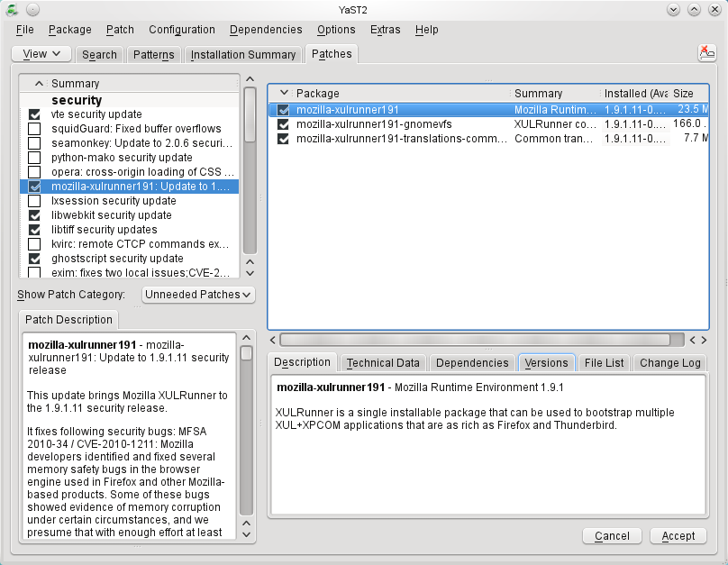
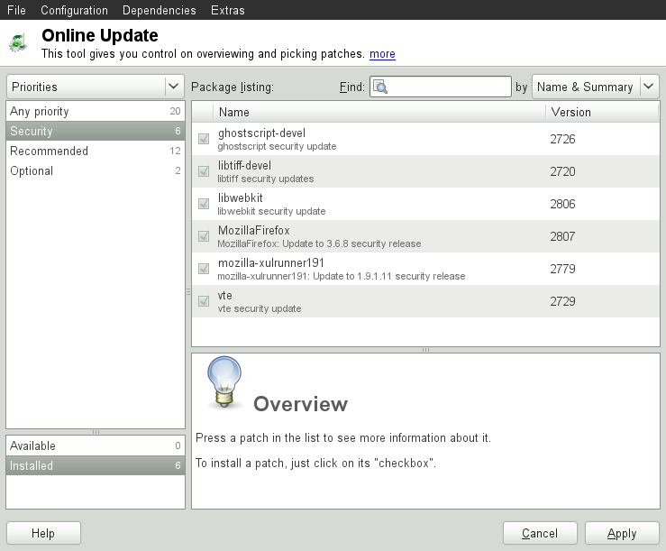

## YaST Online Update

openSUSE offers a continuous stream of software security updates for your product. By default, the update applet is used to keep your system up-to-date. This chapter covers the alternative tool for updating software packages: YaST Online Update.
The current patches for openSUSE® are available from an update software repository, which is automatically configured during the installation. Alternatively, you can manually add an update repository from a source you trust. To add or remove repositories, start the Repository Manager with *Software › Software Repositories in YaST*. Learn more about the Repository Manager in Section “Managing Software Repositories and Services”.

openSUSE provides updates with different relevance levels:

**Security Updates :**
Fix severe security hazards and should always be installed.

**Recommended Updates :**
Fix issues that could compromise your computer.

**Optional Updates :**
Fix non-security relevant issues or provide enhancements.

###1 The Online Update Dialog

The YaST *Online Update* dialog is available in two toolkit flavors: GTK (for GNOME) and Qt (for KDE). Both interfaces differ in look and feel but basically provide the same functions. The following sections provide a brief description of each. To open the dialog, start YaST and select *Software  › Online Update*. Alternatively, start it from the command line with ***yast2 online_update***.

####1.1 KDE Interface (Qt)

The *Online Update* window consists of four sections.

######Figure 6.1: YaST Online Update—Qt Interface

The *Summary* section on the left lists the available patches for openSUSE. The patches are sorted by security relevance: *security*, *recommended*, and *optional*. You can change the view of the *Summary* section by selecting one of the following options from *Show Patch Category*:

**Needed Patches (default view)**

Non-installed patches that apply to packages installed on your system.

**Unneeded Patches**

Patches that either apply to packages not installed on your system, or patches that have requirements which have already have been fulfilled (because the relevant packages have already been updated from another source).

**All Patches**

All patches available for openSUSE.
Each list entry in the *Summary* section consists of a symbol and the patch name. For an overview of the possible symbols and their meaning, press `Shift`–`F1`. Actions required by *Security* and *Recommended* patches are automatically preset. These actions are *Autoinstall*, *Autoupdate* and *Autodelete*.

If you install an up-to-date package from a repository other than the update repository, the requirements of a patch for this package may be fulfilled with this installation. In this case a check mark is displayed in front of the patch summary. The patch will be visible in the list until you mark it for installation. This will in fact not install the patch (because the package already is up-to-date), but mark the patch as having been installed.

Select an entry in the *Summary* section to view a short *Patch Description* at the bottom left corner of the dialog. The upper right section lists the packages included in the selected patch (a patch can consist of several packages). Click an entry in the upper right section to view details about the respective package that is included in the patch.

#####6.1.2 GNOME Interface (GTK)

The *Online Update* window consists of four main sections.

######Figure 6.2: YaST Online Update—GTK Interface

The upper right section lists the available (or already installed) patches for openSUSE. To filter patches according to their security relevance, click the corresponding *Priority* entry in the upper right section of the window: *Security*, *Recommended*, *Optional* or *Any* priority.
If all available patches are already installed, the *Package* listing in the upper right section will show no entries. The box in the bottom left-hand section shows the number of both available and already installed patches and lets you toggle the view to either *Available* or *Installed* patches.

Select an entry in the Package listing section to view a patch description and further details at the bottom right corner of the dialog. As a patch can consist of several packages, click the Applies to entry in the lower right section to see which packages are included in the respective patch.

Click on a patch entry to open a row with detailed information about the patch in the bottom of the window. Here you can see a detailed patch description as well as the versions available. You can also choose to *Install* optional patches—security and recommended patches are already preselected for installation.

####6.2 Installing Patches

The *YaST Online Update* dialog allows you to either install all available patches at once or to manually select the patches that you want to apply to your system. You may also revert patches that have been applied to the system.

By default, all new patches (except optional ones) that are currently available for your system are already marked for installation. They will be applied automatically once you click *Accept* or *Apply*.

**Procedure 6.1: Applying Patches with YaST Online Update **

1.	Start YaST and select *Software › Online Update*.

2.	To automatically apply all new patches (except optional ones) that are currently available for your system, proceed with *Apply* or *Accept* to start the installation of the preselected patches.

3.	To first modify the selection of patches that you want to apply:

    *	Use the respective filters and views the *GTK* and *Qt* interfaces provide. For details, refer to Section 6.1.1, “*KDE Interface (Qt)*” and Section “*GNOME Interface (GTK)*”.
	*   Select or deselect patches according to your needs and wishes by activating or deactivating the respective checkbox (GNOME) or by right-clicking the patch and choosing the respective action from the context menu (KDE).

    >**Important: Always Apply Security Updates :**
Do not deselect any security-related patches without a very good reason. These patches fix severe security hazards and prevent your system from being exploited.

    *	Most patches include updates for several packages. If you want to change actions for single packages, right-click a package in the package view and choose an action (KDE).
    *	To confirm your selection and apply the selected patches, proceed with *Apply* or *Accept*.
4.	After the installation is complete, click *Finish* to leave the YaST *Online Update*. Your system is now up-to-date.

>**Tip: Disabling deltarpms :**
By default, updates are downloaded as deltarpms. Since rebuilding rpm packages from deltarpms is a memory and processor consuming task, certain setups or hardware configurations might require you to disable the usage of deltarpms for the sake of performance.

To disable the use of deltarpms, edit the file /etc/zypp/zypp.conf and set download.use_deltarpm to false.

####6.3 Automatic Online Update

YaST also offers the possibility to set up an automatic update with daily, weekly or monthly schedule. To use the respective module, you need to install the yast2-online-update-configuration package first.

**Procedure 6.2: Configuring the Automatic Online Update **

1.	After installation, start YaST and select *Software › Online Update Configuration*.

    Alternatively, start the module with yast2 online_update_configuration from the command line.

2.	Activate *Automatic Online Update*.

3.	Choose whether to update *Daily*, *Weekly*, or *Monthly*.
Some patches, such as kernel updates or packages requiring license agreements, require user interaction, which would cause the automatic update procedure to stop.

4.	To automatically accept any license agreements, activate *Agree* with *Licenses*.

5.	Select if you also want to *Skip Interactive Patches* in case you want the update procedure to proceed fully automatically.

    >**Important: Skipping Patches :**
If you select to skip any packages that require interaction, run a manual *Online Update* from time to time in order to install those patches, too. Otherwise you might miss important patches.

6.	Confirm your configuration with *OK*.

